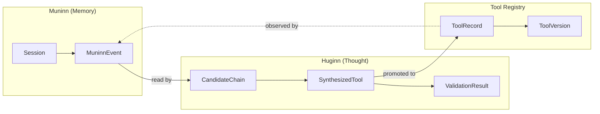
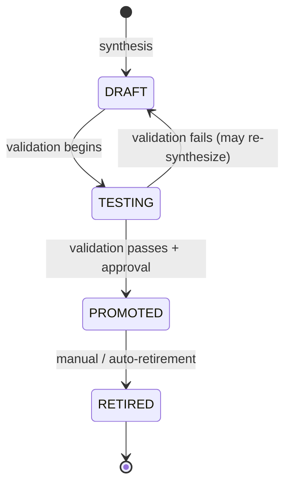
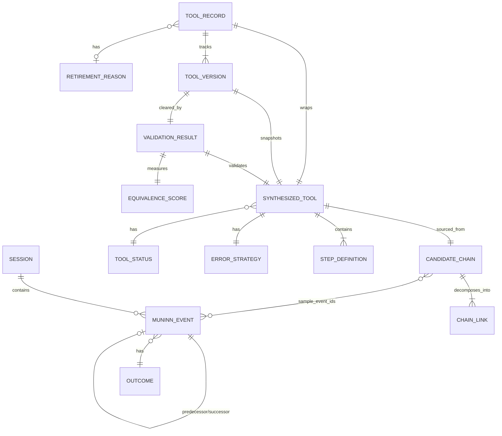

# TwinRaven — Domain Model Specification

> Canonical reference for all entities, value objects, enumerations, and aggregate boundaries in the TwinRaven framework.

---

## Table of Contents

- [Overview](#overview)
- [Bounded Contexts](#bounded-contexts)
- [Muninn Domain (Memory)](#muninn-domain-memory)
  - [MuninnEvent](#muninnevent)
  - [Session](#session)
  - [Outcome](#outcome)
  - [EventTag](#eventtag)
- [Huginn Domain (Thought)](#huginn-domain-thought)
  - [CandidateChain](#candidatechain)
  - [ChainLink](#chainlink)
  - [SynthesizedTool](#synthesizedtool)
  - [StepDefinition](#stepdefinition)
  - [ErrorStrategy](#errorstrategy)
  - [ToolStatus](#toolstatus)
  - [ValidationResult](#validationresult)
  - [EquivalenceScore](#equivalencescore)
- [Tool Registry Domain](#tool-registry-domain)
  - [ToolRecord](#toolrecord)
  - [ToolVersion](#toolversion)
  - [RetirementReason](#retirementreason)
- [Cross-Cutting Concerns](#cross-cutting-concerns)
  - [Identity Strategy](#identity-strategy)
  - [Timestamp Convention](#timestamp-convention)
  - [Hashing Convention](#hashing-convention)
- [Aggregate Boundaries](#aggregate-boundaries)
- [Invariants](#invariants)
- [Entity Relationship Diagram](#entity-relationship-diagram)

---

## Overview

TwinRaven's domain model spans three bounded contexts that mirror the system's architectural layers:

| Context           | Responsibility                                         | Core Aggregate                                     |
| ----------------- | ------------------------------------------------------ | -------------------------------------------------- |
| **Muninn**        | Faithful observation, telemetry capture, event storage | `Session` (contains `MuninnEvent` entities)        |
| **Huginn**        | Pattern mining, tool synthesis, validation             | `CandidateChain` → `SynthesizedTool` pipeline      |
| **Tool Registry** | Lifecycle management for promoted tools                | `ToolRecord` (wraps a versioned `SynthesizedTool`) |

Data flows unidirectionally: Muninn → Huginn → Tool Registry → back into Muninn (via observation of synthesized tools), forming the Huginn-Muninn loop.

---

## Bounded Contexts



Each bounded context owns its data. Huginn reads from Muninn's event log but never writes to it. The Tool Registry receives promoted tools from Huginn but does not reach back into the synthesis pipeline.

---

## Muninn Domain (Memory)

### MuninnEvent

The fundamental unit of observation. Each event represents a single tool invocation captured within an agent session.

| Field            | Type             | Nullable | Description                                                                                                                     |
| ---------------- | ---------------- | :------: | ------------------------------------------------------------------------------------------------------------------------------- |
| `event_id`       | `UUID`           |    No    | Primary key. Generated at capture time.                                                                                         |
| `session_id`     | `str`            |    No    | Groups events into a logical agent session.                                                                                     |
| `tool_id`        | `str`            |    No    | Identifier of the tool that was invoked.                                                                                        |
| `input_hash`     | `str`            |    No    | Deterministic xxhash of `input_params`, used for deduplication and fast equality checks.                                        |
| `input_params`   | `dict`           |    No    | The arguments passed to the tool. Stored as a JSON object.                                                                      |
| `output_summary` | `str`            |   Yes    | LLM-compressed representation of the tool's output. `None` if compression is disabled or the tool produced no output.           |
| `predecessor`    | `UUID`           |   Yes    | `event_id` of the immediately preceding tool call in this session. `None` for the first event in a session.                     |
| `successor`      | `UUID`           |   Yes    | `event_id` of the immediately following tool call. `None` for the last event in a session, or until the next event is recorded. |
| `timestamp`      | `datetime` (UTC) |    No    | When the tool invocation began. Always stored in UTC.                                                                           |
| `latency_ms`     | `int`            |    No    | Wall-clock execution time of the tool call in milliseconds. Must be ≥ 0.                                                        |
| `outcome`        | `Outcome`        |    No    | Result classification of the broader task context.                                                                              |
| `tags`           | `list[str]`      |    No    | Zero or more labels. User-defined or auto-extracted. Defaults to empty list.                                                    |

**Persistence:** Maps to the `muninn_events` table. Append-only; rows are never updated or deleted by application logic. Retention pruning is handled by a separate maintenance process.

**Indexes:** `session_id`, `tool_id`, `timestamp`, `predecessor`, `successor`.

---

### Session

A session is not a persisted entity with its own table. It is an **implicit aggregate boundary** defined by a shared `session_id` value across `MuninnEvent` rows.

| Property      | Type                | Description                                                    |
| ------------- | ------------------- | -------------------------------------------------------------- |
| `session_id`  | `str`               | The grouping key. Format is caller-defined (UUID, slug, etc.). |
| `events`      | `list[MuninnEvent]` | All events sharing this `session_id`, ordered by `timestamp`.  |
| `started_at`  | `datetime`          | Derived: `min(timestamp)` across events.                       |
| `ended_at`    | `datetime`          | Derived: `max(timestamp)` across events.                       |
| `event_count` | `int`               | Derived: `len(events)`.                                        |

**Note:** Session is a read-side projection, not a write-side entity. The Collector does not create a session record; it writes individual events tagged with a `session_id`. Huginn's mining algorithms reconstruct sessions by grouping and ordering events during analysis.

---

### Outcome

Classification of how the tool invocation contributed to its broader task context.

```python
class Outcome(StrEnum):
    SUCCESS = "success"    # Tool executed and the surrounding task succeeded.
    FAILURE = "failure"    # Tool executed but the surrounding task failed.
    PARTIAL = "partial"    # Tool executed; task outcome is ambiguous or incomplete.
```

**Assignment:** The calling agent or integration is responsible for setting the outcome. TwinRaven does not infer task success from tool output alone.

---

### EventTag

Tags are plain strings attached to a `MuninnEvent`. They carry no internal structure or controlled vocabulary at the domain level.

| Source         | Examples                                                  |
| -------------- | --------------------------------------------------------- |
| User-defined   | `"high-priority"`, `"customer-facing"`, `"experiment-42"` |
| Auto-extracted | `"retry"`, `"cached-result"`, `"fallback-path"`           |

Tags are used as optional filters during mining. They do not affect event identity or ordering.

---

## Huginn Domain (Thought)

### CandidateChain

A frequently-observed sequence of tool invocations identified by the mining phase. Candidates are the raw material for tool synthesis.

| Field              | Type             | Nullable | Description                                                                                                                   |
| ------------------ | ---------------- | :------: | ----------------------------------------------------------------------------------------------------------------------------- |
| `chain_id`         | `UUID`           |    No    | Primary key. Generated when the mining algorithm emits the candidate.                                                         |
| `tools`            | `list[str]`      |    No    | Ordered list of `tool_id` values forming the chain. Minimum length: 2.                                                        |
| `support`          | `float`          |    No    | Fraction of sessions containing this chain. Range: 0.0–1.0.                                                                   |
| `confidence`       | `float`          |    No    | Average transition probability across consecutive links. Range: 0.0–1.0.                                                      |
| `avg_latency_ms`   | `int`            |    No    | Mean total execution time of the complete chain across observed instances.                                                    |
| `failure_rate`     | `float`          |    No    | Fraction of instances where the chain ended in a `FAILURE` outcome. Range: 0.0–1.0.                                           |
| `sample_event_ids` | `list[UUID]`     |    No    | Representative `MuninnEvent.event_id` values from source instances. Used for provenance and validation replay.                |
| `discovered_at`    | `datetime` (UTC) |    No    | When the mining run produced this candidate.                                                                                  |
| `mining_config`    | `dict`           |    No    | Snapshot of the mining parameters (algorithm, thresholds, time window) that produced this candidate. Ensures reproducibility. |

**Lifecycle:** `CandidateChain` is immutable once created. A subsequent mining run that rediscovers the same tool sequence at different thresholds produces a new `CandidateChain` with a new `chain_id`.

---

### ChainLink

Describes one transition within a `CandidateChain`. Not persisted independently; it is a decomposition used during synthesis.

| Field                    | Type    | Description                                                          |
| ------------------------ | ------- | -------------------------------------------------------------------- | ------------------------------------------------------- |
| `from_tool`              | `str`   | The predecessor `tool_id`.                                           |
| `to_tool`                | `str`   | The successor `tool_id`.                                             |
| `transition_probability` | `float` | P(to_tool                                                            | from_tool) computed from the event log. Range: 0.0–1.0. |
| `avg_gap_ms`             | `int`   | Mean time between the end of `from_tool` and the start of `to_tool`. |

---

### SynthesizedTool

A composite tool generated from a `CandidateChain`. Represents the LLM's output after parameter merging, error strategy definition, and execution optimization.

| Field             | Type                   | Nullable | Description                                                                                                                                         |
| ----------------- | ---------------------- | :------: | --------------------------------------------------------------------------------------------------------------------------------------------------- |
| `tool_id`         | `str`                  |    No    | Human-reviewable identifier. Auto-generated from the constituent tool names (e.g., `search_read_summarize`), but can be overridden during approval. |
| `description`     | `str`                  |    No    | Natural-language summary of what the composite tool does. LLM-generated.                                                                            |
| `parameters`      | `dict` (JSON Schema)   |    No    | Merged external parameters exposed to the calling agent. Conforms to JSON Schema Draft 2020-12.                                                     |
| `internal_wiring` | `dict`                 |    No    | Maps intermediate outputs from step N to inputs of step N+1. Keys are step indices; values are field-level mappings.                                |
| `steps`           | `list[StepDefinition]` |    No    | Ordered sequence of tool calls with conditions and parallelism hints. Minimum length: 2.                                                            |
| `error_strategy`  | `ErrorStrategy`        |    No    | How the composite tool handles failures at each step.                                                                                               |
| `source_chain_id` | `UUID`                 |    No    | Foreign key to the `CandidateChain` that produced this tool.                                                                                        |
| `version`         | `int`                  |    No    | Monotonically increasing version number. Starts at 1. Incremented on re-synthesis.                                                                  |
| `status`          | `ToolStatus`           |    No    | Current lifecycle state.                                                                                                                            |
| `created_at`      | `datetime` (UTC)       |    No    | When the synthesis run generated this tool.                                                                                                         |
| `promoted_at`     | `datetime` (UTC)       |   Yes    | When the tool was promoted to production. `None` if not yet promoted.                                                                               |
| `retired_at`      | `datetime` (UTC)       |   Yes    | When the tool was retired. `None` if active.                                                                                                        |

---

### StepDefinition

One step within a `SynthesizedTool`'s execution plan.

| Field                 | Type        | Nullable | Description                                                                                                                                |
| --------------------- | ----------- | :------: | ------------------------------------------------------------------------------------------------------------------------------------------ |
| `step_index`          | `int`       |    No    | Position in the step sequence. Zero-based.                                                                                                 |
| `tool_id`             | `str`       |    No    | The underlying tool to invoke.                                                                                                             |
| `input_mapping`       | `dict`      |    No    | How this step's inputs are sourced: from composite parameters, from previous step outputs (via `internal_wiring`), or as literal defaults. |
| `condition`           | `str`       |   Yes    | Optional predicate expression. If present and evaluates to `False`, the step is skipped.                                                   |
| `parallelizable_with` | `list[int]` |    No    | Step indices that can execute concurrently with this step. Empty list means strictly sequential.                                           |
| `timeout_ms`          | `int`       |   Yes    | Optional per-step timeout. If `None`, inherits the global tool timeout.                                                                    |

---

### ErrorStrategy

Defines how a `SynthesizedTool` responds to failures during execution.

| Field              | Type                              | Description                                                                                                              |
| ------------------ | --------------------------------- | ------------------------------------------------------------------------------------------------------------------------ |
| `retry_policy`     | `dict`                            | Per-step retry configuration: `max_retries`, `backoff_strategy` (`fixed` or `exponential`), `backoff_ms`.                |
| `fallback_steps`   | `dict[int, list[StepDefinition]]` | Maps a step index to an alternative step sequence if the primary step fails.                                             |
| `abort_conditions` | `list[str]`                       | Predicate expressions that, if true after any step failure, abort the composite tool immediately and return an error.    |
| `default_behavior` | `str`                             | One of `"retry"`, `"skip"`, or `"abort"`. Applied to steps not explicitly covered by `retry_policy` or `fallback_steps`. |

---

### ToolStatus

Lifecycle state of a `SynthesizedTool`.

```python
class ToolStatus(StrEnum):
    DRAFT    = "draft"      # Generated by Huginn, not yet validated
    TESTING  = "testing"    # Undergoing validation replay
    PROMOTED = "promoted"   # Passed validation, available for agent use
    RETIRED  = "retired"    # Removed from active service
```

**Allowed transitions:**



A tool can only move forward through the lifecycle, with one exception: a tool that fails validation may return to `DRAFT` for re-synthesis. A `RETIRED` tool is terminal; it is never re-promoted (if the same chain re-emerges, a new `SynthesizedTool` is created).

---

### ValidationResult

The output of Huginn's validation phase for a single `SynthesizedTool` candidate.

| Field               | Type               | Nullable | Description                                                                                    |
| ------------------- | ------------------ | :------: | ---------------------------------------------------------------------------------------------- |
| `result_id`         | `UUID`             |    No    | Primary key.                                                                                   |
| `tool_id`           | `str`              |    No    | The `SynthesizedTool.tool_id` being validated.                                                 |
| `tool_version`      | `int`              |    No    | The version of the tool under test.                                                            |
| `sessions_replayed` | `int`              |    No    | Number of historical sessions used in replay.                                                  |
| `equivalence_score` | `EquivalenceScore` |    No    | Aggregate output similarity measurement.                                                       |
| `error_parity`      | `bool`             |    No    | `True` if the composite tool handled all failure cases at least as well as the original chain. |
| `latency_ratio`     | `float`            |    No    | Composite latency / original chain latency. Values ≤ 1.0 indicate improvement.                 |
| `passed`            | `bool`             |    No    | `True` if all validation criteria were met.                                                    |
| `failure_reasons`   | `list[str]`        |    No    | Empty if `passed` is `True`. Otherwise, human-readable explanations of what failed.            |
| `validated_at`      | `datetime` (UTC)   |    No    | When the validation run completed.                                                             |

---

### EquivalenceScore

Measures how closely a composite tool's outputs match the original chain's outputs across replayed sessions.

| Field             | Type    | Description                                                             |
| ----------------- | ------- | ----------------------------------------------------------------------- |
| `mean_similarity` | `float` | Average output similarity across all replayed sessions. Range: 0.0–1.0. |
| `min_similarity`  | `float` | Worst-case similarity observed. Range: 0.0–1.0.                         |
| `method`          | `str`   | Similarity method used (e.g., `"cosine_tfidf"`, `"exact_match"`).       |
| `threshold`       | `float` | The minimum `mean_similarity` required to pass. Sourced from config.    |

---

## Tool Registry Domain

### ToolRecord

A registry-level wrapper around a promoted `SynthesizedTool`. Tracks operational metadata that doesn't belong in the Huginn domain.

| Field               | Type               | Nullable | Description                                                                                          |
| ------------------- | ------------------ | :------: | ---------------------------------------------------------------------------------------------------- |
| `tool_id`           | `str`              |    No    | Primary key. Same as `SynthesizedTool.tool_id`.                                                      |
| `current_version`   | `int`              |    No    | The active version number.                                                                           |
| `definition_path`   | `str`              |    No    | Filesystem path to the JSON definition file in `tools/generated/`.                                   |
| `registered_at`     | `datetime` (UTC)   |    No    | When the tool entered the registry.                                                                  |
| `last_used_at`      | `datetime` (UTC)   |   Yes    | Timestamp of the most recent invocation observed by Muninn. `None` if never used since registration. |
| `invocation_count`  | `int`              |    No    | Total number of times this tool has been invoked. Starts at 0.                                       |
| `retirement_reason` | `RetirementReason` |   Yes    | `None` if active. Set when the tool is retired.                                                      |

---

### ToolVersion

Represents one version of a tool's definition. The registry maintains a version history for audit and rollback.

| Field               | Type                       | Description                                                       |
| ------------------- | -------------------------- | ----------------------------------------------------------------- |
| `tool_id`           | `str`                      | Parent tool.                                                      |
| `version`           | `int`                      | Version number.                                                   |
| `definition`        | `SynthesizedTool`          | Full tool definition snapshot.                                    |
| `validation_result` | `ValidationResult`         | The validation run that cleared this version for promotion.       |
| `superseded_at`     | `datetime` (UTC) or `None` | When this version was replaced by a newer one. `None` if current. |

---

### RetirementReason

Why a tool was removed from active service.

```python
class RetirementReason(StrEnum):
    MANUAL        = "manual"          # A human explicitly retired it
    AUTO_UNUSED   = "auto_unused"     # No invocations within auto_retire_after_days
    DRIFT         = "drift"           # Usage patterns diverged from the source chain
    FAILURE_SPIKE = "failure_spike"   # Failure rate exceeded acceptable threshold
    SUPERSEDED    = "superseded"      # Replaced by a newer version of the same tool
```

---

## Cross-Cutting Concerns

### Identity Strategy

| Entity             | ID Type      | Generation                                              |
| ------------------ | ------------ | ------------------------------------------------------- |
| `MuninnEvent`      | `UUID` (v4)  | Generated at capture time by the Collector              |
| `CandidateChain`   | `UUID` (v4)  | Generated by the mining algorithm                       |
| `SynthesizedTool`  | `str` (slug) | Auto-generated from constituent tool names, overridable |
| `ValidationResult` | `UUID` (v4)  | Generated by the validation runner                      |
| `ToolRecord`       | `str` (slug) | Matches `SynthesizedTool.tool_id`                       |

`SynthesizedTool.tool_id` and `ToolRecord.tool_id` are human-readable slugs (e.g., `search_read_summarize`) rather than UUIDs. Uniqueness is enforced by the registry; versioning handles the case where the same chain produces an updated tool.

### Timestamp Convention

All timestamps are stored as UTC `datetime` objects with timezone information (`datetime` with `tzinfo=UTC`). Display-layer formatting is the caller's responsibility.

### Hashing Convention

`MuninnEvent.input_hash` uses the xxhash algorithm (XXH64) applied to a canonicalized JSON serialization of `input_params`. Canonicalization means: keys sorted, no whitespace, deterministic float representation. This enables fast equality checks without comparing full parameter objects.

---

## Aggregate Boundaries

| Aggregate Root       | Contains                          | Consistency Boundary                                                                                                                             |
| -------------------- | --------------------------------- | ------------------------------------------------------------------------------------------------------------------------------------------------ |
| `Session` (implicit) | `MuninnEvent`                     | Write: individual events are independent (no cross-event transactions). Read: sessions are reconstructed by grouping events.                     |
| `CandidateChain`     | `ChainLink` (derived)             | Immutable after creation. A new mining run produces new candidates.                                                                              |
| `SynthesizedTool`    | `StepDefinition`, `ErrorStrategy` | Mutable only through lifecycle transitions (`status` changes). Definition content is immutable after synthesis; changes produce a new `version`. |
| `ToolRecord`         | `ToolVersion`                     | Mutable: `last_used_at`, `invocation_count`, `current_version`, `retirement_reason` update over time.                                            |

---

## Invariants

### Muninn Invariants

1. **Append-only event log.** `MuninnEvent` rows are never updated or deleted by application logic. Corrections are new events.
2. **Chain integrity.** If `event A.successor = B.event_id`, then `event B.predecessor = A.event_id`. The Collector must maintain this bidirectional link.
3. **Session ordering.** Within a session, `predecessor`/`successor` links define a strict total order consistent with `timestamp` ordering.
4. **Non-negative latency.** `latency_ms ≥ 0`.
5. **Hash determinism.** Two events with identical `input_params` must produce identical `input_hash` values.

### Huginn Invariants

6. **Minimum chain length.** `CandidateChain.tools` must contain at least 2 elements. A single tool is not a chain.
7. **Statistical bounds.** `support`, `confidence`, and `failure_rate` must all be in range `[0.0, 1.0]`.
8. **Valid transitions only.** `ToolStatus` changes must follow the state diagram. No skipping states (e.g., `DRAFT` → `PROMOTED` is illegal).
9. **Monotonic versioning.** `SynthesizedTool.version` increments by exactly 1 on each re-synthesis. No gaps, no reuse.
10. **Provenance required.** Every `SynthesizedTool` must reference a valid `CandidateChain` via `source_chain_id`.

### Tool Registry Invariants

11. **Single active version.** A `ToolRecord` has exactly one `current_version` at any time.
12. **Retirement is terminal.** A retired `ToolRecord` cannot be re-promoted. New synthesis produces a new `SynthesizedTool` with a new `version`.
13. **Usage tracking fidelity.** `invocation_count` is monotonically increasing and `last_used_at` is monotonically non-decreasing.

---

## Entity Relationship Diagram



---

## Appendix: Design Decisions

**Why is Session implicit?** Sessions are a read-side grouping, not a write-side entity. The Collector writes individual events as fast as possible; introducing a session record would add a synchronization point and complicate the append-only model. Session boundaries are cheap to reconstruct from `session_id` grouping.

**Why is CandidateChain immutable?** Mining is a batch process. Each run produces a fresh set of candidates from current data. Mutating old candidates would create ambiguity about which data supported a given chain. Immutability makes provenance trivial.

**Why are tool IDs slugs instead of UUIDs?** Because humans review and approve synthesized tools. `search_read_summarize` is immediately meaningful in a CLI output; `a3b8d1b6-0b3b-4b1a-9c1a-1a2b3c4d5e6f` is not. Versioning handles the uniqueness problem that slugs would otherwise create.

**Why is retirement terminal?** To prevent zombie tools. If a chain resurfaces after its tool was retired, the correct behavior is a fresh synthesis pass that produces an updated tool reflecting current usage patterns, not resurrecting a stale definition.
