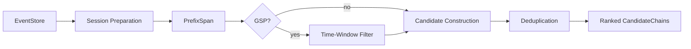

# Huginn Mining — Component Design

> Internal implementation details for the pattern mining pipeline: session preparation, PrefixSpan execution, GSP post-processing, and candidate ranking.
>
> **Prerequisites:** [Domain Model](domain-model.md) · [Service Interfaces](service-interfaces.md)

---

## Table of Contents

- [Pipeline Overview](#pipeline-overview)
- [Session Preparation](#session-preparation)
  - [Event Retrieval](#event-retrieval)
  - [Sequence Extraction](#sequence-extraction)
  - [Session Filtering](#session-filtering)
- [PrefixSpan Execution](#prefixspan-execution)
  - [Input Format](#input-format)
  - [Output Processing](#output-processing)
  - [Support Calculation](#support-calculation)
- [GSP Post-Processing](#gsp-post-processing)
  - [Time-Window Filtering](#time-window-filtering)
  - [Gap Calculation](#gap-calculation)
- [Candidate Construction](#candidate-construction)
  - [Confidence Scoring](#confidence-scoring)
  - [Failure Rate Computation](#failure-rate-computation)
  - [Sample Selection](#sample-selection)
- [Deduplication](#deduplication)
- [Performance Considerations](#performance-considerations)
- [Configuration](#configuration)

---

## Pipeline Overview

The mining pipeline transforms raw `MuninnEvent` data into ranked `CandidateChain` objects through a sequence of stages:



Each stage reads from the previous stage's output. No stage writes back to the `EventStore`.

---

## Session Preparation

### Event Retrieval

The miner queries the `EventStore` for all sessions within the configured time range:

```python
sessions = await event_store.get_sessions(
    since=config.since,
    until=config.until,
)
```

For each session, events are retrieved ordered by timestamp:

```python
for session_id in sessions:
    events = await event_store.get_by_session(session_id, order_by="timestamp")
```

If `config.session_ids` is provided, only those sessions are queried (useful for targeted analysis).

### Sequence Extraction

Each session's events are reduced to a **tool sequence**: an ordered list of `tool_id` values.

```
Session "abc":
    MuninnEvent(tool_id="search", ...)
    MuninnEvent(tool_id="read",   ...)
    MuninnEvent(tool_id="read",   ...)
    MuninnEvent(tool_id="summarize", ...)

Extracted sequence: ["search", "read", "read", "summarize"]
```

**Consecutive deduplication (optional):** If `collapse_repeats: true` in config, consecutive identical tool IDs are collapsed:

```
["search", "read", "read", "summarize"] → ["search", "read", "summarize"]
```

This prevents PrefixSpan from treating `read → read` as a meaningful pattern when it's actually a single tool retrying.

### Session Filtering

Sessions are filtered before mining:

| Filter                  | Default                       | Purpose                                                                    |
| ----------------------- | ----------------------------- | -------------------------------------------------------------------------- |
| `min_event_count`       | 2                             | Exclude trivially short sessions (a single tool call cannot form a chain)  |
| Maximum sequence length | `config.max_chain_length × 3` | Exclude extremely long sessions that would dominate mining (heuristic cap) |

**Metadata preservation:** During extraction, a mapping of `session_id → list[MuninnEvent]` is retained in memory for later use by candidate construction (sample selection, failure rate computation).

---

## PrefixSpan Execution

### Input Format

The `prefixspan` library expects a list of sequences, where each sequence is a list of items:

```python
from prefixspan import PrefixSpan

# Convert tool sequences to PrefixSpan input
database = [
    ["search", "read", "summarize"],           # session 1
    ["search", "read", "summarize"],           # session 2
    ["search", "read", "draft"],               # session 3
    ["analyze", "report"],                      # session 4
    ["search", "read", "summarize", "draft"],  # session 5
]

ps = PrefixSpan(database)
```

### Output Processing

PrefixSpan returns `(support_count, pattern)` tuples:

```python
results = ps.frequent(
    minsup=max(1, int(len(database) * config.min_support)),
    closed=False,
)
# Example output:
# [
#     (4, ["search", "read"]),
#     (3, ["search", "read", "summarize"]),
#     (2, ["search", "read", "summarize", "draft"]),
# ]
```

**Post-filtering:**

1. Discard patterns shorter than 2 items (single tools are not chains).
2. Discard patterns longer than `config.max_chain_length`.
3. Convert absolute support counts to fractional support: `support = count / len(database)`.

### Support Calculation

Support is the fraction of sessions containing the pattern as a subsequence:

```
support = sessions_containing_pattern / total_sessions
```

PrefixSpan computes this natively via its minimum support threshold. The miner applies a secondary check to ensure the fractional support meets `config.min_support` (necessary because PrefixSpan uses absolute counts and rounding can cause edge cases).

---

## GSP Post-Processing

When `config.algorithm = "gsp"`, the PrefixSpan results are filtered through a time-window constraint. This removes patterns where the constituent tool calls happened too far apart to represent a deliberate workflow.

### Time-Window Filtering

For each PrefixSpan pattern, the miner checks every session that contains the pattern:

```python
def passes_time_window(
    pattern: list[str],
    session_events: list[MuninnEvent],
    max_gap_seconds: int,
) -> bool:
    """Check if the pattern occurs within the time window in this session."""
    positions = find_pattern_positions(pattern, session_events)
    for position_set in positions:
        gaps = compute_gaps(position_set, session_events)
        if all(gap <= max_gap_seconds for gap in gaps):
            return True
    return False
```

**Pattern position finding:** For each pattern element, find the matching `MuninnEvent` in the session's event list. A pattern may match at multiple positions; all are checked.

**Gap computation:** The gap between consecutive pattern elements is:

```
gap = event[i+1].timestamp - (event[i].timestamp + event[i].latency_ms)
```

This measures idle time between tool calls, excluding execution time.

### Gap Calculation

After time-window filtering, the miner recomputes support using only the sessions where the pattern passed the window constraint:

```
gsp_support = sessions_passing_window / total_sessions
```

Patterns whose `gsp_support` falls below `config.min_support` are discarded.

---

## Candidate Construction

Each surviving pattern is enriched into a full `CandidateChain`:

### Confidence Scoring

Confidence measures transition probability across consecutive links in the chain:

```
For a chain [A, B, C]:
    P(B|A) = sessions_with_A_followed_by_B / sessions_with_A
    P(C|B) = sessions_with_B_followed_by_C / sessions_with_B
    confidence = mean(P(B|A), P(C|B))
```

**"Followed by"** means B appears after A in the session's tool sequence, not necessarily immediately after. The ordering constraint is sequential containment, not strict adjacency.

Chains with `confidence < config.min_confidence` are discarded.

### Failure Rate Computation

For each session containing the chain, the miner examines the outcome of the final tool call in the chain:

```
failure_rate = sessions_where_final_tool_outcome_is_FAILURE / sessions_containing_chain
```

**Partial outcomes:** `PARTIAL` outcomes are not counted as failures. They are treated as a separate category for analysis but do not disqualify a chain.

### Sample Selection

Each `CandidateChain` includes up to 10 `sample_event_ids` for provenance:

1. From all sessions containing the chain, select up to 10.
2. Prefer recent sessions (sorted by session start timestamp descending).
3. For each selected session, include the `event_id` of the first tool in the chain as it appears in that session.

---

## Deduplication

After candidate construction, the miner deduplicates chains:

**Subsumption rule:** If chain A is a strict subsequence of chain B, and both have comparable support (within 10% relative difference), chain A is removed in favor of the longer chain B. This prevents a 3-tool chain from appearing alongside its 4-tool extension as separate candidates.

**Equality rule:** Two chains with identical `tools` lists are merged. The one with higher support is retained; the other's `sample_event_ids` are appended to the survivor's.

---

## Performance Considerations

### Large Event Logs

| Event count         | Strategy                                                                                                                                |
| ------------------- | --------------------------------------------------------------------------------------------------------------------------------------- |
| < 100,000           | Full in-memory processing. Load all sessions, run PrefixSpan.                                                                           |
| 100,000 – 1,000,000 | Windowed processing. Use `config.since`/`config.until` to limit the analysis window.                                                    |
| > 1,000,000         | Sampled processing. Randomly sample sessions (configurable sample rate) before mining. Results are approximate but dramatically faster. |

**Memory estimate:** Each session's tool sequence costs ~100 bytes on average. 100,000 sessions ≈ 10 MB for sequences alone. The PrefixSpan library's internal state scales with the number of unique patterns found.

### Incremental Mining

The current design is batch-oriented: each mining run processes the full time window from scratch. Future optimization could implement incremental mining:

1. Maintain a watermark (`last_mined_timestamp`).
2. On subsequent runs, only process events since the watermark.
3. Merge new candidates with existing ones in the `CandidateStore`.

This is deferred to a later design iteration. The batch approach is correct and sufficient for initial deployment.

---

## Configuration

Mining configuration within `twinraven.yaml`:

```yaml
huginn:
  mining:
    algorithm: prefixspan # prefixspan | gsp
    min_support: 0.3 # Minimum session frequency (0.0–1.0)
    min_confidence: 0.8 # Minimum transition probability (0.0–1.0)
    max_chain_length: 6 # Discard chains longer than this
    time_window_seconds: 300 # GSP: max gap between consecutive steps
    collapse_repeats: true # Collapse consecutive duplicate tool IDs
    max_sample_events: 10 # Sample event IDs per candidate
    subsumption_threshold: 0.1 # Relative support difference for subsumption
    sample_rate: 1.0 # Session sample rate (1.0 = all sessions)
```
