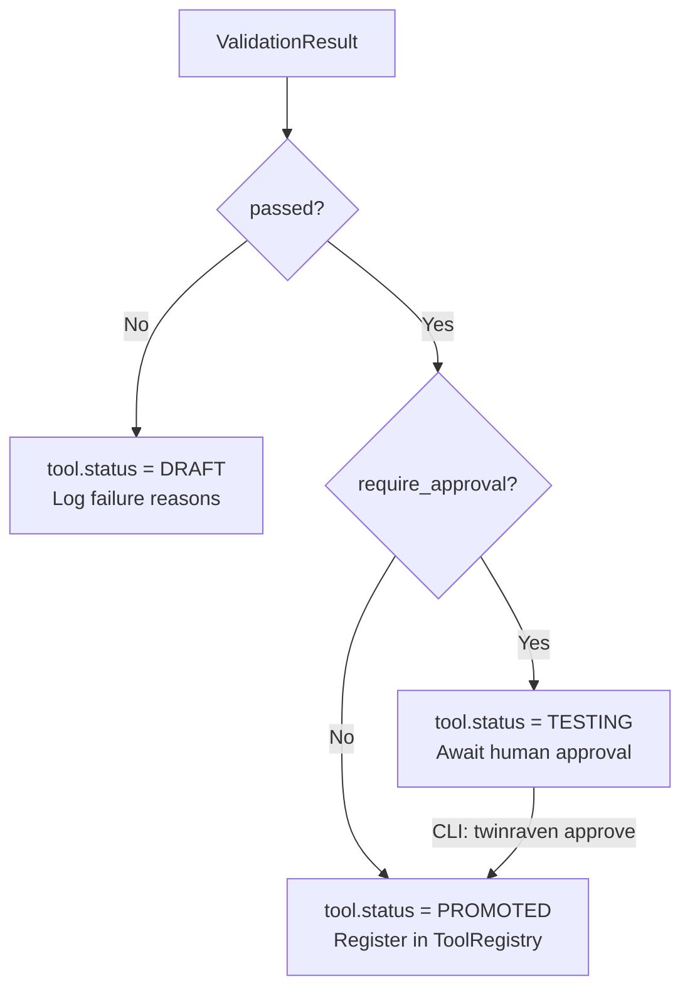

# Huginn Synthesis & Validation — Component Design

> Internal implementation details for LLM-based tool generation and offline validation replay.
>
> **Prerequisites:** [Domain Model](domain-model.md) · [Service Interfaces](service-interfaces.md) · [Mining Pipeline](huginn-mining-component.md)

---

## Table of Contents

- [Synthesis Pipeline](#synthesis-pipeline)
  - [Sample Retrieval](#sample-retrieval)
  - [Parameter Analysis](#parameter-analysis)
  - [LLM Prompt Engineering](#llm-prompt-engineering)
  - [Schema Validation](#schema-validation)
  - [Step Construction](#step-construction)
  - [Error Strategy Generation](#error-strategy-generation)
- [Validation Pipeline](#validation-pipeline)
  - [Session Selection](#session-selection)
  - [Input Extraction](#input-extraction)
  - [Offline Output Comparison](#offline-output-comparison)
  - [Equivalence Scoring](#equivalence-scoring)
  - [Latency Estimation](#latency-estimation)
  - [Error Strategy Verification](#error-strategy-verification)
  - [Promotion Workflow](#promotion-workflow)
- [LLM Provider Implementation](#llm-provider-implementation)
  - [Anthropic Provider](#anthropic-provider)
    — [OpenAI Provider](#openai-provider)
  - [Retry and Rate Limiting](#retry-and-rate-limiting)
- [Configuration](#configuration)

---

## Synthesis Pipeline

### Sample Retrieval

Before prompting the LLM, the synthesizer fetches full context for the candidate chain:

1. For each `event_id` in `chain.sample_event_ids`, retrieve the event from the `EventStore`.
2. For each sample event, retrieve the **full session** it belongs to (via `get_by_session`).
3. Extract the sub-sequence of events matching the chain's tool sequence from each session.

This gives the LLM concrete examples of the chain in action: actual parameters, actual outputs, actual failure cases.

**Data sent to LLM (per sample):**

```python
SynthesisSample = {
    "session_id": str,
    "tools": [
        {
            "tool_id": str,
            "input_params": dict,         # Full input
            "output_summary": str | None,  # Compressed output
            "outcome": str,
            "latency_ms": int,
        }
        for event in chain_events
    ],
}
```

### Parameter Analysis

Before prompting the LLM, the synthesizer performs a deterministic pre-analysis of parameter flow:

**Step 1: Input/output inventory.** For each tool in the chain, collect all observed `input_params` keys across samples.

**Step 2: Overlap detection.** Identify keys that appear both in tool N's output and tool N+1's input:

```python
for i in range(len(chain.tools) - 1):
    output_keys = extract_keys(samples, step=i, field="output_summary")
    input_keys  = extract_keys(samples, step=i+1, field="input_params")
    overlap = output_keys & input_keys
    # overlap = likely internal wiring
```

**Step 3: Classify parameters.**

| Classification      | Rule                                                        | Example                                       |
| ------------------- | ----------------------------------------------------------- | --------------------------------------------- |
| **External**        | Input key at step 0 that doesn't appear in any prior output | `query` in a `search` tool                    |
| **Internal wiring** | Key appears in step N output AND step N+1 input             | `url` from `search` output → `read` input     |
| **Constant**        | Input key with the same value across all samples            | `format: "json"` always passed to `summarize` |
| **Ambiguous**       | Doesn't fit the above categories                            | Forwarded to LLM for resolution               |

This pre-analysis provides structured hints to the LLM prompt, reducing hallucination and improving merge accuracy.

### LLM Prompt Engineering

The synthesis prompt uses a structured template rendered via Jinja2:

```
You are a tool composition engine. Given a frequently-observed chain of tool
calls, generate a composite tool definition that replaces the chain with a
single tool.

## Chain Definition
Tools: {{ chain.tools | join(" → ") }}
Support: {{ chain.support }} ({{ chain.support * 100 }}% of sessions)
Confidence: {{ chain.confidence }}
Avg Latency: {{ chain.avg_latency_ms }}ms

## Parameter Analysis
External parameters (expose to caller):

- {{ param.name }}: {{ param.type }} (from step {{ param.step }})


Internal wiring (connect between steps):

- Step {{ wire.from_step }}.output.{{ wire.from_key }} → Step {{ wire.to_step }}.input.{{ wire.to_key }}


Constants (hardcode):

- Step {{ const.step }}.input.{{ const.key }} = {{ const.value }}


## Sample Executions

### Sample {{ loop.index }} (session: {{ sample.session_id }})

Step {{ loop.index0 }}: {{ tool.tool_id }}
  Input: {{ tool.input_params | tojson }}
  Output: {{ tool.output_summary }}
  Outcome: {{ tool.outcome }}



## Requirements
1. Generate a JSON object conforming to the SynthesizedTool schema.
2. The `parameters` field must be valid JSON Schema Draft 2020-12.
3. The `internal_wiring` must map every internal connection identified above.
4. The `error_strategy` must address observed failure modes from the samples.
5. Mark steps that can run in parallel (max {{ max_parallel_steps }} concurrent).
6. Generate a human-readable `tool_id` slug from the tool names.
7. Generate a clear `description` summarizing what the composite tool does.
```

**Response schema:** The prompt includes a `response_schema` parameter (JSON Schema defining the expected `SynthesizedTool` structure) so the LLM returns structured JSON that can be validated immediately.

**Temperature:** Set to `0.0` for deterministic output. Tool definitions must be reproducible.

### Schema Validation

After the LLM returns a response:

1. Parse the JSON from `LLMResponse.parsed`.
2. Validate `parameters` field against JSON Schema Draft 2020-12 using `jsonschema.validate()`.
3. Verify all `tool_id` references in `steps` match known tools.
4. Verify `internal_wiring` keys reference valid step indices.
5. Verify `parallelizable_with` indices are within bounds and do not create circular dependencies.

If validation fails, the synthesizer makes one retry with an error-correction prompt:

```
The previous response had validation errors:
{{ errors | join("\n") }}

Please correct the output and return a valid SynthesizedTool definition.
```

If the retry also fails, `SynthesisError` is raised.

### Step Construction

After LLM generation and validation, steps are enriched:

1. **Parallelism validation:** Use `networkx.DiGraph` to model step dependencies (from `internal_wiring`). Steps can only be `parallelizable_with` siblings that share no data dependency.

```python
G = nx.DiGraph()
for step in steps:
    G.add_node(step.step_index)
    for dep in get_dependencies(step, internal_wiring):
        G.add_edge(dep, step.step_index)

# A step can parallelize with another only if neither is an ancestor of the other
for step in steps:
    step.parallelizable_with = [
        other.step_index
        for other in steps
        if other.step_index != step.step_index
        and not nx.has_path(G, step.step_index, other.step_index)
        and not nx.has_path(G, other.step_index, step.step_index)
    ][:max_parallel_steps]
```

2. **Condition extraction:** If the LLM generated condition expressions, they are validated as simple Python expressions (no function calls, no imports, no attribute access beyond dict keys).

### Error Strategy Generation

The error strategy is constructed from observed failure patterns in the samples:

1. **Failure inventory:** For each step, count how many samples show a `FAILURE` outcome at that step.
2. **Pattern matching:**
   - If a step fails but the chain eventually succeeds (later steps compensate), generate a `"skip"` fallback.
   - If a step fails and the chain always fails, generate an `"abort"` condition.
   - If a step fails intermittently (< 50% failure rate), generate `"retry"` with exponential backoff.
3. **Default behavior:** Steps with no observed failures get `default_behavior = "abort"` (fail-safe).

---

## Validation Pipeline

### Session Selection

The validator queries for historical sessions that contain the source chain:

```python
candidate_sessions = []
all_sessions = await event_store.get_sessions(since=config.since, until=config.until)

for session_id in all_sessions:
    events = await event_store.get_by_session(session_id)
    tool_sequence = [e.tool_id for e in events]
    if is_subsequence(chain.tools, tool_sequence):
        candidate_sessions.append((session_id, events))
```

**Selection strategy:** Sort by session recency (newest first), take the first `min_replay_sessions`.

**Insufficient data:** If fewer than `min_replay_sessions` sessions are found, raise `InsufficientDataError`.

### Input Extraction

For each selected session, extract the inputs that would be provided to the composite tool:

1. Find the events in the session that match the chain's tool sequence.
2. The **external parameters** of the composite tool map to the first step's `input_params` (minus any internally-wired keys).
3. Capture the intermediate outputs (`output_summary`) at each step for comparison.

```python
ReplaySession = {
    "session_id": str,
    "external_inputs": dict,           # What the composite tool would receive
    "step_outputs": list[str | None],  # Recorded output at each chain step
    "final_output": str | None,        # Output of the last step
    "total_latency_ms": int,           # Sum of latency across chain steps
    "outcome": Outcome,                # Outcome of the final step
}
```

### Offline Output Comparison

The validator does **not** execute any tools. Instead, it verifies structural consistency:

1. **Internal wiring check:** For each step transition, verify that the `internal_wiring` correctly maps the output keys from step N to the input keys of step N+1, using the recorded `input_params` and `output_summary` from the replay session.
2. **Final output projection:** Given the composite tool's parameter merging and wiring logic, trace the data flow through the steps using recorded values. The projected final output should match `replay_session.final_output`.

### Equivalence Scoring

Output similarity is computed between the projected output and the recorded output:

| Method         | Implementation                                              | When to use                                |
| -------------- | ----------------------------------------------------------- | ------------------------------------------ |
| `exact_match`  | `projected == recorded`                                     | Deterministic tools with structured output |
| `cosine_tfidf` | TF-IDF vectorization + cosine similarity via `scikit-learn` | Natural language outputs, summaries        |

```python
from sklearn.feature_extraction.text import TfidfVectorizer
from sklearn.metrics.pairwise import cosine_similarity

def compute_similarity(projected: str, recorded: str, method: str) -> float:
    if method == "exact_match":
        return 1.0 if projected == recorded else 0.0
    elif method == "cosine_tfidf":
        vectorizer = TfidfVectorizer()
        tfidf = vectorizer.fit_transform([projected, recorded])
        return cosine_similarity(tfidf[0:1], tfidf[1:2])[0][0]
```

**Aggregation across sessions:**

```python
EquivalenceScore(
    mean_similarity = mean(scores),
    min_similarity  = min(scores),
    method          = config.similarity_method,
    threshold       = config.equivalence_threshold,
)
```

**Pass criterion:** `mean_similarity ≥ threshold`.

### Latency Estimation

Latency is compared using recorded values, not live measurements:

```python
composite_latency = sum(
    replay_session.step_outputs[i].latency_ms
    for i in range(len(chain.tools))
    # Subtract parallelizable overlap
) - estimated_parallel_savings

original_latency = replay_session.total_latency_ms

latency_ratio = composite_latency / original_latency
```

**Parallel savings estimation:** For steps marked as `parallelizable_with`, the estimated savings is `max(latency_of_parallel_steps) - sum(latency_of_parallel_steps)` (i.e., parallel steps run in the time of the slowest, not the sum).

**Pass criterion:** `latency_ratio ≤ config.max_latency_regression`.

### Error Strategy Verification

For sessions where the original chain encountered failures:

1. Identify which step failed and what the `outcome` was.
2. Check whether the composite tool's `ErrorStrategy` covers that step:
   - If `retry_policy` exists for the step, verify `max_retries > 0`.
   - If `fallback_steps` exist for the step, verify the fallback path is defined.
   - If `abort_conditions` match the failure, verify the abort is explicit (not silent).
3. **Error parity** is `True` if every observed failure mode is handled by at least one strategy.

### Promotion Workflow

After validation completes:



When approval is required, the tool remains in `TESTING` until a human runs `twinraven approve <tool-id> --promote`.

---

## LLM Provider Implementation

### Anthropic Provider

```python
class AnthropicProvider:
    def __init__(self, api_key: str, model: str = "claude-sonnet-4-20250514"):
        self._client = AsyncAnthropic(api_key=api_key)
        self._model = model

    async def generate(self, prompt: str, *, response_schema=None, max_tokens=4096, temperature=0.0):
        message = await self._client.messages.create(
            model=self._model,
            max_tokens=max_tokens,
            temperature=temperature,
            messages=[{"role": "user", "content": prompt}],
        )
        content = message.content[0].text
        parsed = json.loads(content) if response_schema else None

        if response_schema and parsed:
            jsonschema.validate(parsed, response_schema)

        return LLMResponse(
            content=content,
            parsed=parsed,
            model=self._model,
            input_tokens=message.usage.input_tokens,
            output_tokens=message.usage.output_tokens,
            latency_ms=...,
        )
```

### OpenAI Provider

Same structure, using `AsyncOpenAI` and `chat.completions.create`. If `response_schema` is provided, uses OpenAI's structured output mode (`response_format={"type": "json_schema", ...}`).

### Retry and Rate Limiting

Both providers wrap API calls with retry logic:

| Parameter         | Default                | Description                                  |
| ----------------- | ---------------------- | -------------------------------------------- |
| `max_retries`     | 3                      | Maximum retry attempts on transient failures |
| `backoff_base_ms` | 1000                   | Initial backoff delay                        |
| `backoff_factor`  | 2.0                    | Exponential multiplier                       |
| `retry_on`        | `[429, 500, 502, 503]` | HTTP status codes that trigger retry         |
| `timeout_seconds` | 120                    | Per-request timeout                          |

Rate limit responses (HTTP 429) respect the `Retry-After` header when present.

---

## Configuration

```yaml
huginn:
  synthesis:
    llm_model: claude-sonnet-4-20250514 # Model identifier (determines provider)
    require_approval: true # Human-in-the-loop before promotion
    max_parallel_steps: 3 # Cap on concurrent steps in generated tools
    max_retries_on_invalid: 1 # Retry count if LLM output fails validation
    prompt_template: default # Template name (extensible)

  validation:
    min_replay_sessions: 10 # Minimum sessions for replay
    equivalence_threshold: 0.95 # Mean similarity required to pass
    max_latency_regression: 1.2 # Max acceptable latency ratio
    similarity_method: cosine_tfidf # cosine_tfidf | exact_match

  llm:
    timeout_seconds: 120 # Per-request timeout
    max_retries: 3 # Retry on transient failures
    backoff_base_ms: 1000 # Initial retry delay
    backoff_factor: 2.0 # Exponential backoff multiplier
```
