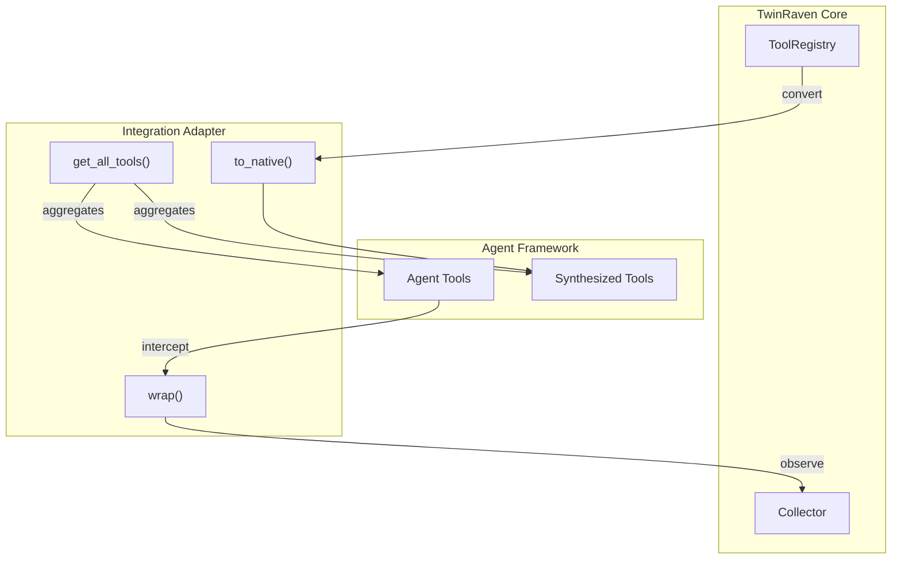

# Integrations & CLI — Component Design

> Internal implementation details for framework adapters (LangChain, CrewAI) and the command-line interface.
>
> **Prerequisites:** [Domain Model](domain-model.md) · [Service Interfaces](service-interfaces.md)

---

## Table of Contents

- [Integration Architecture](#integration-architecture)
- [LangChain Adapter](#langchain-adapter)
  - [Tool Wrapping](#tool-wrapping)
  - [Synthesized Tool Injection](#synthesized-tool-injection)
- [CrewAI Adapter](#crewai-adapter)
- [Custom Agent Adapter](#custom-agent-adapter)
- [CLI Design](#cli-design)
  - [Command Structure](#command-structure)
  - [Core Commands](#core-commands)
  - [Output Formatting](#output-formatting)
  - [Interactive Workflows](#interactive-workflows)
- [Configuration Loading](#configuration-loading)

---

## Integration Architecture

All adapters share a common structure:



Each adapter handles two responsibilities:

1. **Observation wrapping:** Intercept tool calls to feed Muninn without changing the tool's external behavior.
2. **Synthesis injection:** Convert `SynthesizedTool` definitions into framework-native tools so agents can use them without knowing they're composite.

---

## LangChain Adapter

### Tool Wrapping

Wrapping a LangChain `BaseTool` produces a subclass that intercepts execution:

```python
class ObservedLangChainTool(BaseTool):
    """LangChain tool wrapper that records invocations to Muninn."""

    name: str
    description: str
    _inner_tool: BaseTool
    _context: ObservationContext

    async def _arun(self, **kwargs) -> str:
        start = time.monotonic()
        try:
            result = await self._inner_tool._arun(**kwargs)
            latency = int((time.monotonic() - start) * 1000)
            await self._context.record(
                tool_id=self.name,
                input_params=kwargs,
                output=result,
                outcome=Outcome.SUCCESS,
                latency_ms=latency,
            )
            return result
        except Exception as e:
            latency = int((time.monotonic() - start) * 1000)
            await self._context.record_failure(
                tool_id=self.name,
                input_params=kwargs,
                error=e,
                latency_ms=latency,
            )
            raise

    def _run(self, **kwargs) -> str:
        """Sync fallback. Delegates to _arun via asyncio."""
        return asyncio.run(self._arun(**kwargs))
```

**Transparency guarantees:**

- The wrapped tool's `name`, `description`, and `args_schema` are identical to the inner tool.
- Exceptions raised by the inner tool propagate unchanged after recording.
- Latency measurement is entirely within the wrapper; it does not add observable delay.

### Synthesized Tool Injection

Converting a `SynthesizedTool` into a LangChain-native tool:

```python
class SynthesizedLangChainTool(StructuredTool):
    """LangChain tool backed by a TwinRaven synthesized tool definition."""

    name: str                    # From SynthesizedTool.tool_id
    description: str             # From SynthesizedTool.description
    args_schema: Type[BaseModel] # Generated from SynthesizedTool.parameters

    _definition: SynthesizedTool
    _tool_resolver: Callable[[str], BaseTool]   # Resolves tool_id → actual tool

    async def _arun(self, **kwargs) -> str:
        executor = StepExecutor(self._definition, self._tool_resolver)
        return await executor.run(kwargs)
```

**`StepExecutor`:** A shared utility (not adapter-specific) that:

1. Maps external parameters to step 0's input via `input_mapping`.
2. Executes steps in order, respecting `parallelizable_with` via `asyncio.gather`.
3. Passes intermediate outputs through `internal_wiring`.
4. Evaluates `condition` expressions before each step.
5. Applies `error_strategy` on failures (retry, fallback, abort).
6. Returns the final step's output.

### args_schema Generation

The `SynthesizedTool.parameters` (JSON Schema) is converted to a Pydantic model at runtime:

```python
def json_schema_to_pydantic(schema: dict, model_name: str) -> Type[BaseModel]:
    """Convert a JSON Schema to a Pydantic model class."""
    fields = {}
    for name, prop in schema.get("properties", {}).items():
        python_type = map_json_type(prop["type"])
        default = prop.get("default", ...)
        if name not in schema.get("required", []):
            python_type = python_type | None
            default = default if default is not ... else None
        fields[name] = (python_type, Field(default=default, description=prop.get("description")))

    return create_model(model_name, **fields)
```

---

## CrewAI Adapter

The CrewAI adapter follows the same pattern but targets CrewAI's tool contract:

```python
class ObservedCrewAITool:
    """CrewAI tool wrapper with Muninn observation."""

    name: str
    description: str
    _inner_tool: Any
    _context: ObservationContext

    def run(self, **kwargs) -> str:
        start = time.monotonic()
        try:
            result = self._inner_tool.run(**kwargs)
            latency = int((time.monotonic() - start) * 1000)
            asyncio.run(self._context.record(
                tool_id=self.name,
                input_params=kwargs,
                output=result,
                outcome=Outcome.SUCCESS,
                latency_ms=latency,
            ))
            return result
        except Exception as e:
            latency = int((time.monotonic() - start) * 1000)
            asyncio.run(self._context.record_failure(
                tool_id=self.name,
                input_params=kwargs,
                error=e,
                latency_ms=latency,
            ))
            raise
```

**Key difference from LangChain:** CrewAI tools are primarily synchronous. The adapter uses `asyncio.run()` to call the async Collector methods from sync context. In environments with a running event loop, `asyncio.get_event_loop().run_until_complete()` is used instead.

---

## Custom Agent Adapter

For agents that don't use a framework, tools are plain callables:

```python
class ObservedCallable:
    """Wraps a plain function or coroutine with Muninn observation."""

    def __init__(self, fn: Callable, tool_id: str, context: ObservationContext):
        self._fn = fn
        self._tool_id = tool_id
        self._context = context
        self.__name__ = fn.__name__
        self.__doc__ = fn.__doc__

    async def __call__(self, **kwargs):
        start = time.monotonic()
        try:
            if asyncio.iscoroutinefunction(self._fn):
                result = await self._fn(**kwargs)
            else:
                result = self._fn(**kwargs)
            latency = int((time.monotonic() - start) * 1000)
            await self._context.record(
                tool_id=self._tool_id,
                input_params=kwargs,
                output=result,
                outcome=Outcome.SUCCESS,
                latency_ms=latency,
            )
            return result
        except Exception as e:
            latency = int((time.monotonic() - start) * 1000)
            await self._context.record_failure(
                tool_id=self._tool_id,
                input_params=kwargs,
                error=e,
                latency_ms=latency,
            )
            raise
```

**`to_native` for custom agents:** Returns a plain `async def` callable that executes the `StepExecutor`.

---

## CLI Design

Built with **Typer** for argument parsing and **Rich** for terminal output.

### Command Structure

```
twinraven
├── observe         # Start an observation session (interactive)
├── mine            # Run the mining pipeline
├── synthesize      # Synthesize a tool from a candidate chain
├── validate        # Run validation on a synthesized tool
├── approve         # Approve a tool for promotion
├── registry        # Tool registry management
│   ├── list        # List registered tools
│   ├── inspect     # Show tool details and definition
│   ├── retire      # Retire a tool
│   ├── rollback    # Rollback to a previous version
│   └── usage       # Show usage statistics
├── export          # Export event log
│   ├── json        # Export as JSON Lines
│   ├── parquet     # Export as Parquet
│   └── otlp        # Push to OTLP endpoint
├── maintain        # Run maintenance operations
│   ├── prune       # Prune old events
│   ├── drift       # Run drift detection
│   └── stale       # Check for stale tools
├── config          # Configuration management
│   ├── show        # Display current config
│   └── validate    # Validate config file
└── version         # Show version info
```

### Core Commands

#### `twinraven mine`

```bash
twinraven mine \
    --algorithm prefixspan \
    --min-support 0.3 \
    --min-confidence 0.8 \
    --max-chain-length 6 \
    --since 2026-01-01 \
    --output table           # table | json | csv
```

**Output (table):**

```
┌──────────────────────────────┬─────────┬────────────┬─────────────┬──────────────┐
│ Chain                        │ Support │ Confidence │ Avg Latency │ Failure Rate │
├──────────────────────────────┼─────────┼────────────┼─────────────┼──────────────┤
│ search → read → summarize   │   0.45  │    0.92    │    1,230ms  │     0.05     │
│ fetch → parse → extract     │   0.38  │    0.88    │      870ms  │     0.08     │
│ search → read               │   0.52  │    0.95    │      650ms  │     0.03     │
└──────────────────────────────┴─────────┴────────────┴─────────────┴──────────────┘
Found 3 candidate chains from 1,247 sessions.
```

#### `twinraven approve`

```bash
twinraven approve search_read_summarize --promote
```

Displays the full tool definition with Rich syntax highlighting, then prompts for confirmation:

```
Tool: search_read_summarize (v1)
Status: TESTING → PROMOTED
Validation: ✅ passed (equivalence: 0.97, latency ratio: 0.85)

Promote this tool? [y/N]:
```

#### `twinraven registry list`

```bash
twinraven registry list --status promoted
```

```
┌─────────────────────────┬─────────┬────────────────┬─────────────┬──────────────┐
│ Tool ID                 │ Version │ Registered     │ Last Used   │ Invocations  │
├─────────────────────────┼─────────┼────────────────┼─────────────┼──────────────┤
│ search_read_summarize   │  v2     │ 2026-01-15     │ 2026-02-14  │        142   │
│ fetch_parse_extract     │  v1     │ 2026-01-20     │ 2026-02-10  │         87   │
└─────────────────────────┴─────────┴────────────────┴─────────────┴──────────────┘
2 promoted tools.
```

#### `twinraven registry inspect`

```bash
twinraven registry inspect search_read_summarize
```

Displays the full JSON definition with Rich JSON highlighting, version history, validation results, and usage statistics.

### Output Formatting

All commands support three output modes:

| Mode  | Flag                       | Implementation                               |
| ----- | -------------------------- | -------------------------------------------- |
| Table | `--output table` (default) | Rich `Table` with colors and borders         |
| JSON  | `--output json`            | Structured JSON to stdout (machine-readable) |
| CSV   | `--output csv`             | CSV to stdout (spreadsheet-compatible)       |

**Color scheme (table mode):**

| Element           | Color     |
| ----------------- | --------- |
| Tool ID           | Cyan      |
| `PROMOTED` status | Green     |
| `TESTING` status  | Yellow    |
| `RETIRED` status  | Dim/Gray  |
| `DRAFT` status    | White     |
| Error messages    | Red       |
| Validation passed | Green ✅  |
| Validation failed | Red ❌    |
| Drift warning     | Yellow ⚠️ |

### Interactive Workflows

For complex operations, the CLI uses Rich prompts and panels:

**Synthesis review workflow:**

```
twinraven synthesize <chain-id>
```

1. Display the candidate chain summary in a Rich Panel.
2. Show the generated tool definition with syntax highlighting.
3. Prompt: `Proceed to validation? [Y/n]:`
4. Run validation and display results.
5. If `require_approval: true`: `Promote to production? [y/N]:`
6. If approved, register and promote.

---

## Configuration Loading

Configuration is loaded from `twinraven.yaml` (or `TWINRAVEN_CONFIG` env var):

**Resolution order:**

1. `TWINRAVEN_CONFIG` environment variable (absolute path).
2. `./twinraven.yaml` in the current working directory.
3. `~/.config/twinraven/twinraven.yaml` (user-level defaults).

**Merge behavior:** User-level config provides defaults; project-level config overrides. Environment variables override everything (following `TWINRAVEN__SECTION__KEY` convention):

```bash
TWINRAVEN__MUNINN__STORE=postgresql+asyncpg://... twinraven mine
```

**Validation:** All config is loaded into a Pydantic `TwinRavenConfig` model. Invalid config raises `ConfigurationError` with a human-readable message. `twinraven config validate` runs this check without starting any operation.

**Full config schema:**

```yaml
muninn: # See muninn-component.md
  store: sqlite+aiosqlite:///muninn.db
  output_compression: true
  max_output_length: 500
  retention_days: 90
  collector: { mode: immediate, buffer_size: 50, flush_interval_seconds: 5 }
  pool: { pool_size: 5, max_overflow: 10, pool_timeout: 30, pool_recycle: 3600 }
  exporters:
    json: { field_order: alphabetical }
    parquet: { batch_size: 10000, compression: snappy }
    otlp: { endpoint: "http://localhost:4317", flush_interval_seconds: 5 }

huginn: # See huginn-*-component.md
  mining:
    algorithm: prefixspan
    min_support: 0.3
    min_confidence: 0.8
    max_chain_length: 6
    time_window_seconds: 300
    collapse_repeats: true
    max_sample_events: 10
    subsumption_threshold: 0.1
    sample_rate: 1.0
  synthesis:
    llm_model: claude-sonnet-4-20250514
    require_approval: true
    max_parallel_steps: 3
    max_retries_on_invalid: 1
    prompt_template: default
  validation:
    min_replay_sessions: 10
    equivalence_threshold: 0.95
    max_latency_regression: 1.2
    similarity_method: cosine_tfidf
  llm:
    timeout_seconds: 120
    max_retries: 3
    backoff_base_ms: 1000
    backoff_factor: 2.0

registry: # See tool-registry-component.md
  storage_dir: tools/generated
  auto_retire_after_days: 30
  auto_retire_on_drift: false
  drift_threshold: 0.5
  failure_spike_threshold: 0.3
  maintenance_schedule: weekly
```
