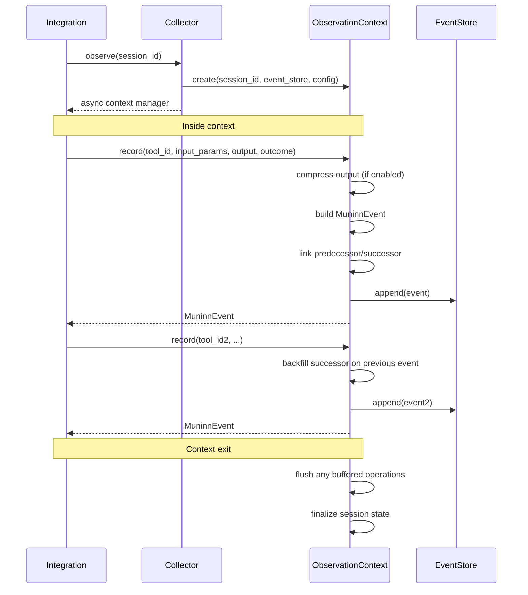

# Muninn — Component Design

> Internal implementation details for the Memory layer: Collector, EventStore, output compression, and exporters.
>
> **Prerequisites:** [Domain Model](domain-model.md) · [Service Interfaces](service-interfaces.md)

---

## Table of Contents

- [Collector Internals](#collector-internals)
  - [Integration Hookup](#integration-hookup)
  - [Context Manager Lifecycle](#context-manager-lifecycle)
  - [Predecessor/Successor Management](#predecessorsuccessor-management)
  - [Output Compression](#output-compression)
  - [Buffering Strategy](#buffering-strategy)
  - [Failure Scenarios](#failure-scenarios)
- [EventStore Implementation](#eventstore-implementation)
  - [SQLAlchemy Model](#sqlalchemy-model)
  - [Indexing Strategy](#indexing-strategy)
  - [Connection Management](#connection-management)
  - [Chain Reconstruction](#chain-reconstruction)
- [Exporters](#exporters)
  - [Streaming and Backpressure](#streaming-and-backpressure)
  - [JSON Lines Exporter](#json-lines-exporter)
  - [Parquet Exporter](#parquet-exporter)
  - [OTLP Exporter](#otlp-exporter)
  - [Error Handling and Recovery](#error-handling-and-recovery)
- [Retention and Pruning](#retention-and-pruning)
- [Configuration](#configuration)

---

## Collector Internals

The `Collector` is the primary write-path entry point. Integrations interact exclusively with the Collector; they never write to the `EventStore` directly.

### Integration Hookup

The Collector exposes a single entry point, `observe()`, which returns an async context manager. Everything an integration needs to capture telemetry flows through this one call.

**LangChain integration (typical):**

```python
from twinraven import Collector
from twinraven.integrations.langchain import LangChainWrapper

# 1. Create a collector (once, at application startup)
collector = Collector(event_store=event_store, config=muninn_config)

# 2. Wrap existing tools (once, at agent setup)
wrapper = LangChainWrapper()
tools = [wrapper.wrap(tool, collector) for tool in original_tools]

# 3. Run the agent — telemetry is captured automatically
agent = create_agent(llm, tools)
async with collector.observe(session_id="task-42") as ctx:
    # Every tool call inside this block is recorded.
    # The wrapper calls ctx.record() transparently.
    result = await agent.ainvoke({"input": "Find and summarize the report"})
```

**Custom agent (no framework):**

```python
from twinraven import Collector

collector = Collector(event_store=event_store, config=muninn_config)

async with collector.observe(session_id="manual-session-1") as ctx:
    # Record tool calls explicitly
    search_result = await search_tool(query="quarterly report")
    event1 = await ctx.record(
        tool_id="search",
        input_params={"query": "quarterly report"},
        output=search_result,
        outcome=Outcome.SUCCESS,
    )

    # Record a failure
    try:
        content = await read_tool(url=search_result["url"])
    except TimeoutError as e:
        event2 = await ctx.record_failure(
            tool_id="read",
            input_params={"url": search_result["url"]},
            error=e,
            tags=["timeout", "retry-candidate"],
        )
```

**Key guarantees for integrations:**

1. The context manager is **non-blocking on enter**. It initializes state and verifies store connectivity but does not issue any writes until `record()` is called.
2. Calling `record()` outside of a context raises `CollectorError`. The context must be active.
3. Multiple concurrent contexts for different `session_id` values are supported. Each `ObservationContext` tracks its own predecessor chain independently.
4. A single context should **not** be shared across threads or tasks. One context = one logical session = one sequential chain of tool calls.

### Context Manager Lifecycle



**On entry (`__aenter__`):**

1. Initialize internal state: `_previous_event: MuninnEvent | None = None`, `_event_count: int = 0`.
2. Verify `EventStore` connectivity (fast check, not a full query).
3. Log session start at `DEBUG` level.

**On exit (`__aexit__`):**

1. If events were buffered (see [Buffering Strategy](#buffering-strategy)), flush the remaining buffer.
2. Log session summary at `INFO` level: `session_id`, `event_count`, total session duration.
3. If an exception propagated through the context, log it at `WARNING` but do **not** suppress it. Events already persisted remain in the log.

### Predecessor/Successor Management

Bidirectional linking is managed entirely within the `ObservationContext`:

```
record(event_1):
    event_1.predecessor = None
    event_1.successor = None       ← not yet known
    _previous_event = event_1

record(event_2):
    event_2.predecessor = event_1.event_id
    event_1.successor = event_2.event_id   ← backfill
    _previous_event = event_2
```

**Backfill mechanism:** The context holds a reference to the last persisted event. When a new event is recorded, the context:

1. Sets `new_event.predecessor = _previous_event.event_id`.
2. Updates `_previous_event.successor = new_event.event_id` in-memory.
3. Issues a targeted `UPDATE` against the EventStore for the predecessor's `successor` field.
4. Appends the new event via `EventStore.append()`.

**Why UPDATE, not a second append?** The successor backfill is the single exception to the "append-only" principle at the application level. The alternative (appending a correction event) would double the event count and complicate chain reconstruction. The `successor` field is explicitly documented in the Domain Model as backfilled, not immutable.

**Failure during backfill:** If the `UPDATE` for the predecessor's `successor` fails but the new event's `append` succeeds, the chain has a forward gap. This is acceptable: chain reconstruction can fall back to timestamp ordering. The gap is logged at `WARNING`.

### Output Compression

When `output_compression: true` in config, the Collector compresses tool outputs before storage.

**Pipeline:**

1. Serialize `output` to a string representation (JSON for dicts/lists, `str()` for other types).
2. If the serialized length exceeds `max_output_length` (default: 500 chars), send it to the `LLMProvider` with a summarization prompt.
3. If the serialized length is within the limit, store it directly as `output_summary`.
4. If the LLM call fails, fall back to truncation: `output[:max_output_length] + "... [truncated]"`.

**Summarization prompt template:**

```
Summarize the following tool output in a single concise paragraph.
Preserve key data points, identifiers, and error messages.
Maximum length: {max_output_length} characters.

Tool: {tool_id}
Output:
{output}
```

**Performance consideration:** LLM summarization adds latency to the `record()` call. For high-throughput scenarios, compression can be deferred to a background task (see [Buffering Strategy](#buffering-strategy)) or disabled entirely.

### Buffering Strategy

The default behavior is **immediate persistence**: each `record()` call results in an immediate `EventStore.append()`. For high-throughput agent loops, an optional buffering mode is available:

| Mode                  | Behavior                                          | Trade-off                                             |
| --------------------- | ------------------------------------------------- | ----------------------------------------------------- |
| `immediate` (default) | Each `record()` call appends synchronously.       | Highest durability, higher per-event overhead.        |
| `buffered`            | Events accumulate in memory and flush in batches. | Lower per-event overhead, risk of data loss on crash. |

**Buffered mode configuration:**

```yaml
muninn:
  collector:
    mode: buffered
    buffer_size: 50 # Flush after N events
    flush_interval_seconds: 5 # Flush after N seconds, even if buffer isn't full
```

**Flush triggers:**

1. Buffer reaches `buffer_size`.
2. `flush_interval_seconds` elapsed since last flush.
3. Context manager exits (normal or exceptional).

Buffered events are flushed via `EventStore.append_batch()` for atomicity.

### Failure Scenarios

The Collector is designed to be resilient: telemetry failures should never crash the agent. Each failure mode has a defined, predictable behavior.

| Scenario                                      | What happens                                                                  | Impact on session                                                                                                                                                                  | Recovery                                                                                                   |
| --------------------------------------------- | ----------------------------------------------------------------------------- | ---------------------------------------------------------------------------------------------------------------------------------------------------------------------------------- | ---------------------------------------------------------------------------------------------------------- |
| **Store unavailable on `observe()` entry**    | `_check_connectivity()` fails, `CollectorError` raised.                       | Context never opens. No events recorded.                                                                                                                                           | Integration catches the error and decides whether to run without telemetry or abort.                       |
| **Store unavailable during `record()`**       | `EventStore.append()` raises `StorageError`.                                  | The failed event is **lost**. The `ObservationContext` logs the failure at `ERROR` and continues accepting subsequent `record()` calls. Predecessor chain is broken at this point. | Subsequent `record()` calls succeed if the store recovers. The gap is visible during chain reconstruction. |
| **Output compression (LLM) fails**            | LLM call raises `LLMProviderError` or times out.                              | Falls back to truncation: `output[:max_output_length] + "... [truncated]"`. Event is still recorded.                                                                               | No recovery needed; degraded output quality is acceptable. Logged at `WARNING`.                            |
| **Tool raises exception mid-call**            | Integration catches the exception and calls `record_failure()`.               | A `MuninnEvent` with `outcome=FAILURE` is created. The error message and traceback summary are stored in `output_summary`.                                                         | Normal flow; this is the designed path for tool failures.                                                  |
| **Agent crashes (context never exits)**       | `__aexit__` is never called.                                                  | **Immediate mode:** All events up to the crash are persisted (each `record()` call writes immediately). **Buffered mode:** Events in the unflushed buffer are lost.                | Partial session is visible in the event log. Mining handles sessions of any length.                        |
| **Exception propagates through context exit** | `__aexit__` receives the exception info.                                      | Buffered events are flushed (best effort). Session summary is logged at `WARNING` instead of `INFO`. The exception is **not** suppressed; it re-raises after cleanup.              | Events already persisted are retained. The session appears truncated but valid.                            |
| **Backfill UPDATE fails**                     | Predecessor's `successor` field isn't updated, but the new event is appended. | Forward chain has a gap at this link. `predecessor` on the new event is correct; `successor` on the old event is `None`.                                                           | Chain reconstruction falls back to timestamp ordering for the gap. Logged at `WARNING`.                    |
| **Buffered flush fails**                      | `append_batch()` raises `StorageError`.                                       | The entire batch is lost if the store rejects it.                                                                                                                                  | The buffer is cleared (no retry). Subsequent batches attempt independent writes. Logged at `ERROR`.        |

**Design philosophy:** The Collector follows a _best-effort, never-fatal_ pattern. Telemetry is valuable but secondary to the agent's primary task. Every failure path either degrades gracefully (compression fallback, chain gaps) or fails silently with logging (store unavailability). The only exception that propagates to the integration is the initial `observe()` connectivity check, giving the integration a chance to decide up front.

---

## EventStore Implementation

### SQLAlchemy Model

The `muninn_events` table maps directly to the `MuninnEvent` domain entity:

```python
class MuninnEventRow(Base):
    __tablename__ = "muninn_events"

    event_id:       Mapped[UUID]     = mapped_column(primary_key=True)
    session_id:     Mapped[str]      = mapped_column(String(256), nullable=False)
    tool_id:        Mapped[str]      = mapped_column(String(256), nullable=False)
    input_hash:     Mapped[str]      = mapped_column(String(16), nullable=False)
    input_params:   Mapped[dict]     = mapped_column(JSON, nullable=False)
    output_summary: Mapped[str|None] = mapped_column(Text, nullable=True)
    predecessor:    Mapped[UUID|None]= mapped_column(ForeignKey("muninn_events.event_id"), nullable=True)
    successor:      Mapped[UUID|None]= mapped_column(ForeignKey("muninn_events.event_id"), nullable=True)
    timestamp:      Mapped[datetime] = mapped_column(DateTime(timezone=True), nullable=False)
    latency_ms:     Mapped[int]      = mapped_column(Integer, nullable=False)
    outcome:        Mapped[str]      = mapped_column(String(16), nullable=False)
    tags:           Mapped[list]     = mapped_column(JSON, nullable=False, default=list)
```

**Domain ↔ ORM mapping:** A `MuninnEventMapper` class handles bidirectional conversion between `MuninnEvent` (Pydantic model) and `MuninnEventRow` (SQLAlchemy model). The domain model never imports SQLAlchemy types.

### Indexing Strategy

| Index                  | Columns                 | Type             | Purpose                                                |
| ---------------------- | ----------------------- | ---------------- | ------------------------------------------------------ |
| `ix_session_id`        | `session_id`            | B-tree           | Session lookup, mining session grouping                |
| `ix_tool_id`           | `tool_id`               | B-tree           | Tool-specific queries                                  |
| `ix_timestamp`         | `timestamp`             | B-tree           | Time-range queries, retention pruning                  |
| `ix_predecessor`       | `predecessor`           | B-tree           | Chain reconstruction (forward walk)                    |
| `ix_successor`         | `successor`             | B-tree           | Chain reconstruction (backward walk)                   |
| `ix_session_timestamp` | `session_id, timestamp` | Composite B-tree | Primary mining query: all events in a session, ordered |
| `ix_tool_timestamp`    | `tool_id, timestamp`    | Composite B-tree | Tool usage over time                                   |

**PostgreSQL-specific:** For `input_params` and `tags` (JSON columns), GIN indexes can be added for content-based filtering, but this is deferred until profiling indicates a need.

### Connection Management

```python
class AsyncEventStoreEngine:
    """Manages the async SQLAlchemy engine and session factory."""

    def __init__(self, connection_uri: str, pool_config: PoolConfig):
        self._engine = create_async_engine(
            connection_uri,
            pool_size=pool_config.pool_size,           # Default: 5
            max_overflow=pool_config.max_overflow,     # Default: 10
            pool_timeout=pool_config.pool_timeout,     # Default: 30s
            pool_recycle=pool_config.pool_recycle,     # Default: 3600s
            echo=pool_config.echo_sql,                 # Default: False
        )
        self._session_factory = async_sessionmaker(self._engine, expire_on_commit=False)
```

| Backend    | URI Pattern                     | Pool Behavior                                             |
| ---------- | ------------------------------- | --------------------------------------------------------- |
| SQLite     | `sqlite+aiosqlite:///muninn.db` | `pool_size=1`, `max_overflow=0` (SQLite is single-writer) |
| PostgreSQL | `postgresql+asyncpg://...`      | Configurable pool with connection recycling               |

**Health check:** The `EventStore` exposes an internal `_check_connectivity()` method called during `Collector.observe()` entry. It runs `SELECT 1` against the backend with a 5-second timeout.

### Chain Reconstruction

`get_by_session(order_by="chain")` reconstructs the linked list:

1. Fetch all events for the `session_id` in a single query.
2. Find the head event: the one with `predecessor = None`.
3. Walk `successor` pointers to build the ordered list.
4. **Orphan handling:** If any events are unreachable from the head (due to backfill gaps), append them sorted by `timestamp` at the end.
5. **Cycle detection:** If a `successor` pointer references an already-visited event, break the chain and log at `WARNING`.

---

## Exporters

All exporters implement the `Exporter` protocol and accept an `AsyncIterable[MuninnEvent]` to support streaming over large datasets without loading the full event log into memory.

### Streaming and Backpressure

Exporters consume events lazily from the `AsyncIterable` source. The write pipeline applies backpressure naturally through the async iteration protocol:

```python
async def export(self, events: AsyncIterable[MuninnEvent], destination, *, overwrite=False):
    async with self._open_writer(destination, overwrite) as writer:
        count = 0
        async for event in events:
            await writer.write(self._serialize(event))
            count += 1
    return ExportResult(rows_exported=count, ...)
```

**Backpressure behavior:** If the writer is slower than the event source (e.g., OTLP endpoint is congested), the `async for` loop blocks on `writer.write()`, which naturally slows consumption from the source. No explicit buffering or rate limiting is needed because the async iteration protocol provides flow control implicitly.

**Memory guarantee:** At any point during export, at most one event plus the writer's internal buffer (if any) is held in memory. The pattern is strictly one-event-at-a-time for JSON Lines, batched for Parquet (see batch size below), and batched for OTLP (see flush interval below).

### JSON Lines Exporter

**Format:** One JSON object per line (`.jsonl`). Each line is a self-contained `MuninnEvent`.

```json
{
  "event_id": "a1b2c3d4-...",
  "session_id": "session-001",
  "tool_id": "search",
  "input_hash": "abc123",
  "input_params": { "query": "test" },
  "output_summary": "Found 5 results",
  "predecessor": null,
  "successor": "e5f6g7h8-...",
  "timestamp": "2026-01-15T10:30:00Z",
  "latency_ms": 142,
  "outcome": "success",
  "tags": ["web"]
}
```

**Serialization rules:**

- Field order is alphabetical for deterministic output and diffability.
- `datetime` values serialize to ISO 8601 with `Z` suffix (UTC).
- `UUID` values serialize to lowercase hyphenated strings.
- `None` values serialize to JSON `null`.

**Atomicity:** The exporter writes to a temporary file (`<destination>.tmp`) and renames on success. If the export fails mid-stream, the partial `.tmp` file is deleted and the original destination (if any) is untouched.

### Parquet Exporter

**Schema mapping:**

| MuninnEvent field | Arrow Type              | Notes                                                               |
| ----------------- | ----------------------- | ------------------------------------------------------------------- |
| `event_id`        | `string`                | UUID as string (Arrow has no native UUID)                           |
| `session_id`      | `string`                |                                                                     |
| `tool_id`         | `string`                |                                                                     |
| `input_hash`      | `string`                |                                                                     |
| `input_params`    | `string`                | JSON-serialized (nested structs are fragile across Parquet readers) |
| `output_summary`  | `string`                | Nullable                                                            |
| `predecessor`     | `string`                | Nullable UUID as string                                             |
| `successor`       | `string`                | Nullable UUID as string                                             |
| `timestamp`       | `timestamp[us, tz=UTC]` | Microsecond precision                                               |
| `latency_ms`      | `int32`                 |                                                                     |
| `outcome`         | `string`                |                                                                     |
| `tags`            | `list<string>`          | Native Arrow list                                                   |

**Write strategy:** Events are buffered into PyArrow `RecordBatch` objects (batch size: 10,000 rows) and written incrementally via `ParquetWriter` to avoid loading the entire export into memory.

**Atomicity:** Same temp-file-and-rename pattern as JSON Lines. A partial Parquet file is not a valid Parquet file (the footer is written last), so a crash mid-export produces an unreadable `.tmp` file that is cleaned up.

### OTLP Exporter

Maps Muninn events to OpenTelemetry spans for ingestion by tracing backends (Jaeger, Grafana Tempo, etc.).

**Span construction:**

```python
from opentelemetry.sdk.trace import TracerProvider
from opentelemetry.sdk.trace.export import BatchSpanProcessor
from opentelemetry.exporter.otlp.proto.grpc.trace_exporter import OTLPSpanExporter

# Setup (once, at exporter initialization)
provider = TracerProvider(
    resource=Resource.create({
        "service.name": "twinraven",
        "service.version": twinraven.__version__,
        "twinraven.component": "muninn",
    })
)
exporter = OTLPSpanExporter(endpoint=config.endpoint, insecure=config.insecure)
provider.add_span_processor(BatchSpanProcessor(
    exporter,
    max_queue_size=2048,
    max_export_batch_size=512,
    schedule_delay_millis=config.flush_interval_seconds * 1000,
))
```

**Field mapping:**

| MuninnEvent field | OTLP Span field                      | Mapping                                                                                                          |
| ----------------- | ------------------------------------ | ---------------------------------------------------------------------------------------------------------------- |
| `event_id`        | `span_id`                            | UUID truncated to 8 bytes via `xxhash.xxh64(event_id.bytes).digest()[:8]`                                        |
| `session_id`      | `trace_id`                           | Deterministic hash: `xxhash.xxh128(session_id.encode()).digest()` (16 bytes)                                     |
| `tool_id`         | `span_name`                          | Direct                                                                                                           |
| `timestamp`       | `start_time`                         | Direct                                                                                                           |
| `latency_ms`      | `end_time`                           | `start_time + timedelta(milliseconds=latency_ms)`                                                                |
| `outcome`         | `status`                             | `SUCCESS` → `StatusCode.OK`, `FAILURE` → `StatusCode.ERROR`, `PARTIAL` → `StatusCode.UNSET`                      |
| `input_params`    | `attributes`                         | Flattened to key-value pairs (max depth: 2). Nested keys use dot notation: `input.query`, `input.options.format` |
| `tags`            | `attributes["twinraven.tags"]`       | Comma-separated string                                                                                           |
| `predecessor`     | `links`                              | Link to predecessor span if present                                                                              |
| `input_hash`      | `attributes["twinraven.input_hash"]` | Direct                                                                                                           |
| `outcome`         | `attributes["twinraven.outcome"]`    | String value (in addition to status mapping)                                                                     |

**Resource attributes:** Every span carries the service identity (`service.name`, `service.version`, `twinraven.component`) so spans are identifiable when mixed with other services in a shared tracing backend.

**Transport:** gRPC via `opentelemetry-exporter-otlp-proto-grpc`. Batch export with configurable flush interval (default: 5 seconds). The `BatchSpanProcessor` handles internal queuing and retry.

**Graceful shutdown:** On exporter `close()`, the `BatchSpanProcessor` is flushed with a 30-second timeout to drain any queued spans before the process exits.

### Error Handling and Recovery

| Exporter       | Failure mode                                  | Behavior                                                                                                                                                               | Recovery                                                                 |
| -------------- | --------------------------------------------- | ---------------------------------------------------------------------------------------------------------------------------------------------------------------------- | ------------------------------------------------------------------------ |
| **JSON Lines** | Disk full mid-write                           | Temp file is deleted. `ExportError` raised with bytes written.                                                                                                         | Re-run after freeing space. No partial output left behind.               |
| **JSON Lines** | Destination exists, `overwrite=False`         | `ExportDestinationExistsError` raised before any writing begins.                                                                                                       | Caller passes `overwrite=True` or chooses a different path.              |
| **Parquet**    | Disk full mid-write                           | Temp file is deleted (partial Parquet is unreadable anyway). `ExportError` raised.                                                                                     | Same as JSON Lines.                                                      |
| **Parquet**    | Schema mismatch (corrupt event)               | The offending event is logged at `WARNING` and skipped. Other events export normally.                                                                                  | Investigate the corrupt event via `twinraven registry inspect`.          |
| **OTLP**       | Endpoint unreachable                          | `BatchSpanProcessor` retries internally (configurable). If all retries fail, spans are dropped and logged at `ERROR`. `ExportError` is raised at the `export()` level. | Check endpoint connectivity.                                             |
| **OTLP**       | Endpoint rejects spans (e.g., quota exceeded) | Treated like unreachable: retry, then drop.                                                                                                                            | Check tracing backend quota/limits.                                      |
| **OTLP**       | Slow endpoint (congestion)                    | `BatchSpanProcessor` queue absorbs bursts up to `max_queue_size` (2048 spans). Beyond that, oldest spans are dropped.                                                  | Increase flush interval or queue size.                                   |
| **All**        | Source `AsyncIterable` raises mid-stream      | Events exported so far are committed (JSON via temp file rename, Parquet footer written, OTLP flushed). `ExportError` wraps the original exception.                    | Partial export is valid and contains all events up to the failure point. |

---

## Retention and Pruning

The `EventStore.prune()` method handles data retention. It is not called during normal operation; it is invoked by a scheduled maintenance task.

**Pruning logic:**

```python
async def prune(self, older_than: datetime) -> int:
    stmt = delete(MuninnEventRow).where(MuninnEventRow.timestamp < older_than)
    result = await session.execute(stmt)
    return result.rowcount
```

**Chain integrity after pruning:** Pruning breaks `predecessor`/`successor` links for events at the boundary. This is acceptable because:

1. Pruned events are outside the mining window (they're older than `retention_days`).
2. Huginn's mining queries always include a `since` parameter that aligns with the retention window.
3. Chain reconstruction handles orphaned pointers gracefully (see [Chain Reconstruction](#chain-reconstruction)).

**Scheduling:** The CLI provides a `twinraven maintain --prune` command. In production deployments, this is run via cron or a container sidecar on a configurable schedule.

---

## Configuration

Muninn's configuration is a subsection of the top-level `twinraven.yaml`:

```yaml
muninn:
  store: sqlite+aiosqlite:///muninn.db # Connection URI
  output_compression: true # Enable LLM summarization
  max_output_length: 500 # Max chars for output_summary
  retention_days: 90 # Prune events older than this

  collector:
    mode: immediate # immediate | buffered
    buffer_size: 50 # Buffered mode: batch size
    flush_interval_seconds: 5 # Buffered mode: time-based flush

  pool:
    pool_size: 5 # Connection pool size
    max_overflow: 10 # Additional connections beyond pool_size
    pool_timeout: 30 # Seconds to wait for a connection
    pool_recycle: 3600 # Seconds before recycling a connection

  exporters:
    json:
      field_order: alphabetical # alphabetical | schema
    parquet:
      batch_size: 10000 # Rows per RecordBatch
      compression: snappy # snappy | gzip | zstd | none
    otlp:
      endpoint: "http://localhost:4317" # gRPC endpoint
      flush_interval_seconds: 5 # Batch flush interval
```

**Validation:** Configuration is loaded into a Pydantic `MuninnConfig` model at startup. Invalid values raise `ConfigurationError` with a human-readable message before any components are initialized.
