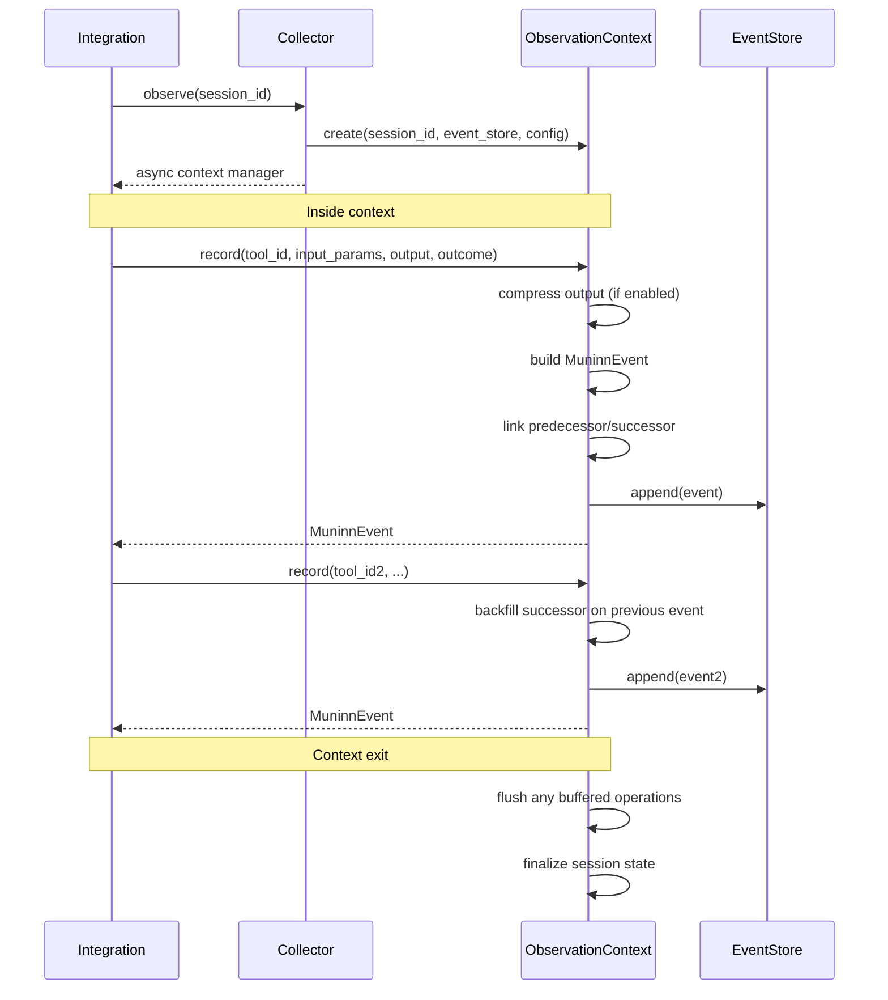

# Muninn — Component Design

> Internal implementation details for the Memory layer: Collector, EventStore, output compression, and exporters.
>
> **Prerequisites:** [Domain Model](domain-model.md) · [Service Interfaces](service-interfaces.md)

---

## Table of Contents

- [Collector Internals](#collector-internals)
  - [Context Manager Lifecycle](#context-manager-lifecycle)
  - [Predecessor/Successor Management](#predecessorsuccessor-management)
  - [Output Compression](#output-compression)
  - [Buffering Strategy](#buffering-strategy)
- [EventStore Implementation](#eventstore-implementation)
  - [SQLAlchemy Model](#sqlalchemy-model)
  - [Indexing Strategy](#indexing-strategy)
  - [Connection Management](#connection-management)
  - [Chain Reconstruction](#chain-reconstruction)
- [Exporters](#exporters)
  - [JSON Lines Exporter](#json-lines-exporter)
  - [Parquet Exporter](#parquet-exporter)
  - [OTLP Exporter](#otlp-exporter)
- [Retention and Pruning](#retention-and-pruning)
- [Configuration](#configuration)

---

## Collector Internals

The `Collector` is the primary write-path entry point. Integrations interact exclusively with the Collector; they never write to the `EventStore` directly.

### Context Manager Lifecycle



**On entry (`__aenter__`):**

1. Initialize internal state: `_previous_event: MuninnEvent | None = None`, `_event_count: int = 0`.
2. Verify `EventStore` connectivity (fast check, not a full query).
3. Log session start at `DEBUG` level.

**On exit (`__aexit__`):**

1. If events were buffered (see [Buffering Strategy](#buffering-strategy)), flush the remaining buffer.
2. Log session summary at `INFO` level: `session_id`, `event_count`, total session duration.
3. If an exception propagated through the context, log it at `WARNING` but do **not** suppress it. Events already persisted remain in the log.

### Predecessor/Successor Management

Bidirectional linking is managed entirely within the `ObservationContext`:

```
record(event_1):
    event_1.predecessor = None
    event_1.successor = None       ← not yet known
    _previous_event = event_1

record(event_2):
    event_2.predecessor = event_1.event_id
    event_1.successor = event_2.event_id   ← backfill
    _previous_event = event_2
```

**Backfill mechanism:** The context holds a reference to the last persisted event. When a new event is recorded, the context:

1. Sets `new_event.predecessor = _previous_event.event_id`.
2. Updates `_previous_event.successor = new_event.event_id` in-memory.
3. Issues a targeted `UPDATE` against the EventStore for the predecessor's `successor` field.
4. Appends the new event via `EventStore.append()`.

**Why UPDATE, not a second append?** The successor backfill is the single exception to the "append-only" principle at the application level. The alternative (appending a correction event) would double the event count and complicate chain reconstruction. The `successor` field is explicitly documented in the Domain Model as backfilled, not immutable.

**Failure during backfill:** If the `UPDATE` for the predecessor's `successor` fails but the new event's `append` succeeds, the chain has a forward gap. This is acceptable: chain reconstruction can fall back to timestamp ordering. The gap is logged at `WARNING`.

### Output Compression

When `output_compression: true` in config, the Collector compresses tool outputs before storage.

**Pipeline:**

1. Serialize `output` to a string representation (JSON for dicts/lists, `str()` for other types).
2. If the serialized length exceeds `max_output_length` (default: 500 chars), send it to the `LLMProvider` with a summarization prompt.
3. If the serialized length is within the limit, store it directly as `output_summary`.
4. If the LLM call fails, fall back to truncation: `output[:max_output_length] + "... [truncated]"`.

**Summarization prompt template:**

```
Summarize the following tool output in a single concise paragraph.
Preserve key data points, identifiers, and error messages.
Maximum length: {max_output_length} characters.

Tool: {tool_id}
Output:
{output}
```

**Performance consideration:** LLM summarization adds latency to the `record()` call. For high-throughput scenarios, compression can be deferred to a background task (see [Buffering Strategy](#buffering-strategy)) or disabled entirely.

### Buffering Strategy

The default behavior is **immediate persistence**: each `record()` call results in an immediate `EventStore.append()`. For high-throughput agent loops, an optional buffering mode is available:

| Mode                  | Behavior                                          | Trade-off                                             |
| --------------------- | ------------------------------------------------- | ----------------------------------------------------- |
| `immediate` (default) | Each `record()` call appends synchronously.       | Highest durability, higher per-event overhead.        |
| `buffered`            | Events accumulate in memory and flush in batches. | Lower per-event overhead, risk of data loss on crash. |

**Buffered mode configuration:**

```yaml
muninn:
  collector:
    mode: buffered
    buffer_size: 50 # Flush after N events
    flush_interval_seconds: 5 # Flush after N seconds, even if buffer isn't full
```

**Flush triggers:**

1. Buffer reaches `buffer_size`.
2. `flush_interval_seconds` elapsed since last flush.
3. Context manager exits (normal or exceptional).

Buffered events are flushed via `EventStore.append_batch()` for atomicity.

---

## EventStore Implementation

### SQLAlchemy Model

The `muninn_events` table maps directly to the `MuninnEvent` domain entity:

```python
class MuninnEventRow(Base):
    __tablename__ = "muninn_events"

    event_id:       Mapped[UUID]     = mapped_column(primary_key=True)
    session_id:     Mapped[str]      = mapped_column(String(256), nullable=False)
    tool_id:        Mapped[str]      = mapped_column(String(256), nullable=False)
    input_hash:     Mapped[str]      = mapped_column(String(16), nullable=False)
    input_params:   Mapped[dict]     = mapped_column(JSON, nullable=False)
    output_summary: Mapped[str|None] = mapped_column(Text, nullable=True)
    predecessor:    Mapped[UUID|None]= mapped_column(ForeignKey("muninn_events.event_id"), nullable=True)
    successor:      Mapped[UUID|None]= mapped_column(ForeignKey("muninn_events.event_id"), nullable=True)
    timestamp:      Mapped[datetime] = mapped_column(DateTime(timezone=True), nullable=False)
    latency_ms:     Mapped[int]      = mapped_column(Integer, nullable=False)
    outcome:        Mapped[str]      = mapped_column(String(16), nullable=False)
    tags:           Mapped[list]     = mapped_column(JSON, nullable=False, default=list)
```

**Domain ↔ ORM mapping:** A `MuninnEventMapper` class handles bidirectional conversion between `MuninnEvent` (Pydantic model) and `MuninnEventRow` (SQLAlchemy model). The domain model never imports SQLAlchemy types.

### Indexing Strategy

| Index                  | Columns                 | Type             | Purpose                                                |
| ---------------------- | ----------------------- | ---------------- | ------------------------------------------------------ |
| `ix_session_id`        | `session_id`            | B-tree           | Session lookup, mining session grouping                |
| `ix_tool_id`           | `tool_id`               | B-tree           | Tool-specific queries                                  |
| `ix_timestamp`         | `timestamp`             | B-tree           | Time-range queries, retention pruning                  |
| `ix_predecessor`       | `predecessor`           | B-tree           | Chain reconstruction (forward walk)                    |
| `ix_successor`         | `successor`             | B-tree           | Chain reconstruction (backward walk)                   |
| `ix_session_timestamp` | `session_id, timestamp` | Composite B-tree | Primary mining query: all events in a session, ordered |
| `ix_tool_timestamp`    | `tool_id, timestamp`    | Composite B-tree | Tool usage over time                                   |

**PostgreSQL-specific:** For `input_params` and `tags` (JSON columns), GIN indexes can be added for content-based filtering, but this is deferred until profiling indicates a need.

### Connection Management

```python
class AsyncEventStoreEngine:
    """Manages the async SQLAlchemy engine and session factory."""

    def __init__(self, connection_uri: str, pool_config: PoolConfig):
        self._engine = create_async_engine(
            connection_uri,
            pool_size=pool_config.pool_size,           # Default: 5
            max_overflow=pool_config.max_overflow,     # Default: 10
            pool_timeout=pool_config.pool_timeout,     # Default: 30s
            pool_recycle=pool_config.pool_recycle,     # Default: 3600s
            echo=pool_config.echo_sql,                 # Default: False
        )
        self._session_factory = async_sessionmaker(self._engine, expire_on_commit=False)
```

| Backend    | URI Pattern                     | Pool Behavior                                             |
| ---------- | ------------------------------- | --------------------------------------------------------- |
| SQLite     | `sqlite+aiosqlite:///muninn.db` | `pool_size=1`, `max_overflow=0` (SQLite is single-writer) |
| PostgreSQL | `postgresql+asyncpg://...`      | Configurable pool with connection recycling               |

**Health check:** The `EventStore` exposes an internal `_check_connectivity()` method called during `Collector.observe()` entry. It runs `SELECT 1` against the backend with a 5-second timeout.

### Chain Reconstruction

`get_by_session(order_by="chain")` reconstructs the linked list:

1. Fetch all events for the `session_id` in a single query.
2. Find the head event: the one with `predecessor = None`.
3. Walk `successor` pointers to build the ordered list.
4. **Orphan handling:** If any events are unreachable from the head (due to backfill gaps), append them sorted by `timestamp` at the end.
5. **Cycle detection:** If a `successor` pointer references an already-visited event, break the chain and log at `WARNING`.

---

## Exporters

All exporters implement the `Exporter` protocol and accept an `AsyncIterable[MuninnEvent]` to support streaming over large datasets.

### JSON Lines Exporter

**Format:** One JSON object per line (`.jsonl`). Each line is a self-contained `MuninnEvent`.

```json
{
  "event_id": "a1b2c3d4-...",
  "session_id": "session-001",
  "tool_id": "search",
  "input_hash": "abc123",
  "input_params": { "query": "test" },
  "output_summary": "Found 5 results",
  "predecessor": null,
  "successor": "e5f6g7h8-...",
  "timestamp": "2026-01-15T10:30:00Z",
  "latency_ms": 142,
  "outcome": "success",
  "tags": ["web"]
}
```

**Serialization rules:**

- Field order is alphabetical for deterministic output and diffability.
- `datetime` values serialize to ISO 8601 with `Z` suffix (UTC).
- `UUID` values serialize to lowercase hyphenated strings.
- `None` values serialize to JSON `null`.

### Parquet Exporter

**Schema mapping:**

| MuninnEvent field | Arrow Type              | Notes                                                               |
| ----------------- | ----------------------- | ------------------------------------------------------------------- |
| `event_id`        | `string`                | UUID as string (Arrow has no native UUID)                           |
| `session_id`      | `string`                |                                                                     |
| `tool_id`         | `string`                |                                                                     |
| `input_hash`      | `string`                |                                                                     |
| `input_params`    | `string`                | JSON-serialized (nested structs are fragile across Parquet readers) |
| `output_summary`  | `string`                | Nullable                                                            |
| `predecessor`     | `string`                | Nullable UUID as string                                             |
| `successor`       | `string`                | Nullable UUID as string                                             |
| `timestamp`       | `timestamp[us, tz=UTC]` | Microsecond precision                                               |
| `latency_ms`      | `int32`                 |                                                                     |
| `outcome`         | `string`                |                                                                     |
| `tags`            | `list<string>`          | Native Arrow list                                                   |

**Write strategy:** Events are buffered into PyArrow `RecordBatch` objects (batch size: 10,000 rows) and written incrementally via `ParquetWriter` to avoid loading the entire export into memory.

### OTLP Exporter

Maps Muninn events to OpenTelemetry spans for ingestion by tracing backends (Jaeger, Grafana Tempo, etc.).

| MuninnEvent field | OTLP Span field                | Mapping                                                    |
| ----------------- | ------------------------------ | ---------------------------------------------------------- |
| `event_id`        | `span_id`                      | UUID truncated to 8 bytes                                  |
| `session_id`      | `trace_id`                     | Deterministic hash of `session_id` to 16 bytes             |
| `tool_id`         | `span_name`                    | Direct                                                     |
| `timestamp`       | `start_time`                   | Direct                                                     |
| `latency_ms`      | `end_time`                     | `start_time + latency_ms`                                  |
| `outcome`         | `status`                       | `SUCCESS` → `OK`, `FAILURE` → `ERROR`, `PARTIAL` → `UNSET` |
| `input_params`    | `attributes`                   | Flattened to key-value pairs (max depth: 2)                |
| `tags`            | `attributes["twinraven.tags"]` | Comma-separated string                                     |
| `predecessor`     | `links`                        | Link to predecessor span if present                        |

**Transport:** gRPC via `opentelemetry-exporter-otlp-proto-grpc`. Batch export with configurable flush interval (default: 5 seconds).

---

## Retention and Pruning

The `EventStore.prune()` method handles data retention. It is not called during normal operation; it is invoked by a scheduled maintenance task.

**Pruning logic:**

```python
async def prune(self, older_than: datetime) -> int:
    stmt = delete(MuninnEventRow).where(MuninnEventRow.timestamp < older_than)
    result = await session.execute(stmt)
    return result.rowcount
```

**Chain integrity after pruning:** Pruning breaks `predecessor`/`successor` links for events at the boundary. This is acceptable because:

1. Pruned events are outside the mining window (they're older than `retention_days`).
2. Huginn's mining queries always include a `since` parameter that aligns with the retention window.
3. Chain reconstruction handles orphaned pointers gracefully (see [Chain Reconstruction](#chain-reconstruction)).

**Scheduling:** The CLI provides a `twinraven maintain --prune` command. In production deployments, this is run via cron or a container sidecar on a configurable schedule.

---

## Configuration

Muninn's configuration is a subsection of the top-level `twinraven.yaml`:

```yaml
muninn:
  store: sqlite+aiosqlite:///muninn.db # Connection URI
  output_compression: true # Enable LLM summarization
  max_output_length: 500 # Max chars for output_summary
  retention_days: 90 # Prune events older than this

  collector:
    mode: immediate # immediate | buffered
    buffer_size: 50 # Buffered mode: batch size
    flush_interval_seconds: 5 # Buffered mode: time-based flush

  pool:
    pool_size: 5 # Connection pool size
    max_overflow: 10 # Additional connections beyond pool_size
    pool_timeout: 30 # Seconds to wait for a connection
    pool_recycle: 3600 # Seconds before recycling a connection

  exporters:
    json:
      field_order: alphabetical # alphabetical | schema
    parquet:
      batch_size: 10000 # Rows per RecordBatch
      compression: snappy # snappy | gzip | zstd | none
    otlp:
      endpoint: "http://localhost:4317" # gRPC endpoint
      flush_interval_seconds: 5 # Batch flush interval
```

**Validation:** Configuration is loaded into a Pydantic `MuninnConfig` model at startup. Invalid values raise `ConfigurationError` with a human-readable message before any components are initialized.
