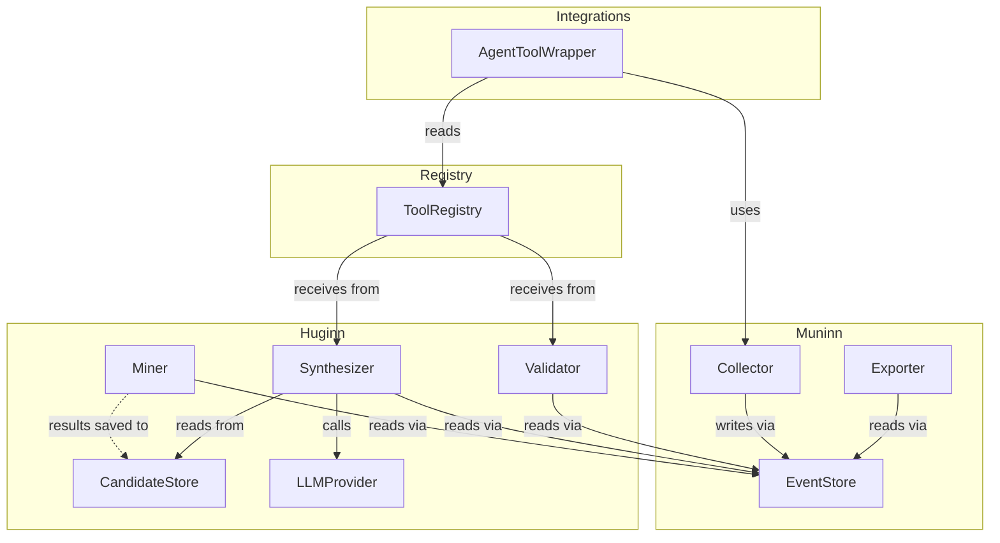

# TwinRaven — Service Interface Specification

> Defines the protocols, contracts, and error semantics at every component boundary. Each interface in this document describes a seam in the architecture that can be implemented and tested independently.
>
> **Prerequisite:** [Domain Model Specification](domain-model.md)

---

## Table of Contents

- [Conventions](#conventions)
- [Muninn Interfaces](#muninn-interfaces)
  - [EventStore](#eventstore)
  - [Collector](#collector)
  - [Exporter](#exporter)
- [Huginn Interfaces](#huginn-interfaces)
  - [Miner](#miner)
  - [CandidateStore](#candidatestore)
  - [Synthesizer](#synthesizer)
  - [Validator](#validator)
  - [LLMProvider](#llmprovider)
- [Tool Registry Interfaces](#tool-registry-interfaces)
  - [ToolRegistry](#toolregistry)
- [Integration Interfaces](#integration-interfaces)
  - [AgentToolWrapper](#agenttoolwrapper)
- [Error Taxonomy](#error-taxonomy)
- [Interface Dependency Map](#interface-dependency-map)

---

## Conventions

**All interfaces are `Protocol` classes** (PEP 544), enabling structural subtyping. Implementations do not need to explicitly inherit from the protocol; they only need to satisfy the method signatures.

**All I/O-bound methods are `async`.** The framework uses `asyncio` throughout. Synchronous wrappers are provided at the CLI and integration layers where needed.

**Return types use domain objects** defined in the [Domain Model Specification](domain-model.md). This document references those types directly (e.g., `MuninnEvent`, `CandidateChain`, `ToolStatus`).

**Error signaling** uses typed exceptions from a shared hierarchy (see [Error Taxonomy](#error-taxonomy)). Methods do not return sentinel values or status codes.

---

## Muninn Interfaces

### EventStore

The persistence layer for the append-only event log. All reads and writes to `MuninnEvent` data go through this interface.

```python
class EventStore(Protocol):
    """Append-only storage for Muninn telemetry events."""

    async def append(self, event: MuninnEvent) -> None: ...

    async def append_batch(self, events: list[MuninnEvent]) -> None: ...

    async def get_by_id(self, event_id: UUID) -> MuninnEvent | None: ...

    async def get_by_session(
        self,
        session_id: str,
        *,
        order_by: Literal["timestamp", "chain"] = "timestamp",
    ) -> list[MuninnEvent]: ...

    async def get_by_tool(
        self,
        tool_id: str,
        *,
        since: datetime | None = None,
        until: datetime | None = None,
        limit: int | None = None,
    ) -> list[MuninnEvent]: ...

    async def get_sessions(
        self,
        *,
        since: datetime | None = None,
        until: datetime | None = None,
        min_event_count: int = 1,
    ) -> list[str]: ...

    async def count(
        self,
        *,
        session_id: str | None = None,
        tool_id: str | None = None,
    ) -> int: ...

    async def prune(self, older_than: datetime) -> int: ...
```

#### Method Contracts

| Method           | Preconditions                                                                     | Postconditions                                                                                                                                  | Errors                                                                             |
| ---------------- | --------------------------------------------------------------------------------- | ----------------------------------------------------------------------------------------------------------------------------------------------- | ---------------------------------------------------------------------------------- |
| `append`         | `event.event_id` must not already exist in the store.                             | Event is durably persisted. `successor` field on the predecessor event (if any) is **not** updated by this method; see [Collector](#collector). | `DuplicateEventError` if `event_id` already exists. `StorageError` on I/O failure. |
| `append_batch`   | All `event_id` values must be unique within the batch and not exist in the store. | All events are persisted atomically (all-or-nothing).                                                                                           | `DuplicateEventError`, `StorageError`.                                             |
| `get_by_id`      | None.                                                                             | Returns `None` if not found.                                                                                                                    | `StorageError`.                                                                    |
| `get_by_session` | None.                                                                             | Returns events ordered by `timestamp` (default) or by `predecessor`/`successor` chain linkage (`"chain"`). Empty list if session not found.     | `StorageError`.                                                                    |
| `get_by_tool`    | None.                                                                             | Returns events filtered by `tool_id` and optional time range, ordered by `timestamp` descending.                                                | `StorageError`.                                                                    |
| `get_sessions`   | None.                                                                             | Returns distinct `session_id` values matching the filters.                                                                                      | `StorageError`.                                                                    |
| `count`          | None.                                                                             | Returns the total number of events matching the optional filters.                                                                               | `StorageError`.                                                                    |
| `prune`          | None.                                                                             | Deletes events with `timestamp < older_than`. Returns the number of deleted rows. **This is the only mutation allowed on the event log.**       | `StorageError`.                                                                    |

#### Design Notes

- `append` does **not** update the predecessor's `successor` field. That bidirectional linking is the Collector's responsibility (it calls `append` for the new event and holds a reference to the previous event for successor backfill).
- `get_by_session` with `order_by="chain"` reconstructs the linked list by walking `predecessor`/`successor` pointers. This is useful for mining but more expensive than timestamp ordering.
- `prune` is the only destructive operation. It is invoked by a scheduled maintenance task, not by normal application flow.

---

### Collector

The observation API that integrations use to capture tool invocations. Manages session context and event construction.

```python
class Collector(Protocol):
    """Captures tool invocation telemetry within a session context."""

    def observe(self, session_id: str) -> AbstractAsyncContextManager[ObservationContext]: ...


class ObservationContext(Protocol):
    """Active observation session. Created by Collector.observe()."""

    @property
    def session_id(self) -> str: ...

    async def record(
        self,
        tool_id: str,
        input_params: dict,
        output: Any,
        outcome: Outcome,
        *,
        tags: list[str] | None = None,
        latency_ms: int | None = None,
    ) -> MuninnEvent: ...

    async def record_failure(
        self,
        tool_id: str,
        input_params: dict,
        error: BaseException,
        *,
        tags: list[str] | None = None,
        latency_ms: int | None = None,
    ) -> MuninnEvent: ...
```

#### Method Contracts

| Method           | Preconditions                                         | Postconditions                                                                                                                                                                                                                                                                | Errors                                                          |
| ---------------- | ----------------------------------------------------- | ----------------------------------------------------------------------------------------------------------------------------------------------------------------------------------------------------------------------------------------------------------------------------- | --------------------------------------------------------------- |
| `observe`        | `session_id` must be a non-empty string.              | Returns an async context manager. On entry, initializes session tracking state. On exit (normal or exceptional), flushes any buffered events.                                                                                                                                 | `CollectorError` if the underlying `EventStore` is unavailable. |
| `record`         | Must be called within an active `ObservationContext`. | Constructs a `MuninnEvent`, links it to the predecessor (if any), compresses `output` into `output_summary` (if compression is enabled), and appends it to the `EventStore`. Returns the persisted event. If `latency_ms` is `None`, the collector measures it automatically. | `CollectorError` on store failure.                              |
| `record_failure` | Must be called within an active `ObservationContext`. | Same as `record`, but sets `outcome` to `FAILURE` and extracts a summary from the exception.                                                                                                                                                                                  | `CollectorError`.                                               |

#### Automatic Behaviors

- **Predecessor linking:** The `ObservationContext` maintains an internal pointer to the last recorded event. Each new `record` call sets `predecessor` to that event's `event_id` and backfills `successor` on the previous event.
- **Output compression:** If `output_compression: true` in config, `output` is passed through an LLM summarization step before storage. The raw output is never persisted.
- **Timing:** If `latency_ms` is not provided, the context tracks wall-clock time between the start and end of the tool call. Integrations that already have timing data can pass it explicitly.

---

### Exporter

Converts event log data into external formats for analysis and integration.

```python
class Exporter(Protocol):
    """Exports Muninn event data to an external format."""

    @property
    def format_name(self) -> str: ...

    async def export(
        self,
        events: AsyncIterable[MuninnEvent],
        destination: str | Path,
        *,
        overwrite: bool = False,
    ) -> ExportResult: ...


class ExportResult:
    """Summary of an export operation."""
    rows_exported: int
    destination: str | Path
    format_name: str
    duration_ms: int
```

#### Implementations

| Format  | `format_name` | Destination                     | Notes                                                                                                            |
| ------- | ------------- | ------------------------------- | ---------------------------------------------------------------------------------------------------------------- |
| JSON    | `"json"`      | File path (`.json` or `.jsonl`) | One JSON object per line (JSON Lines). Deterministic field ordering for diffability.                             |
| Parquet | `"parquet"`   | File path (`.parquet`)          | Columnar format via PyArrow. Nested fields (`input_params`, `tags`) stored as Arrow structs/lists.               |
| OTLP    | `"otlp"`      | gRPC endpoint URL               | Each event becomes a span. `tool_id` maps to span name, `latency_ms` to span duration, `session_id` to trace ID. |

#### Method Contracts

| Method   | Preconditions                                                                                                                                       | Postconditions                                                                                             | Errors                                                                                                    |
| -------- | --------------------------------------------------------------------------------------------------------------------------------------------------- | ---------------------------------------------------------------------------------------------------------- | --------------------------------------------------------------------------------------------------------- |
| `export` | `destination` must be writable (file exporters) or reachable (OTLP). If `overwrite=False`, the destination must not already exist (file exporters). | All events from the iterable are written to the destination. Returns an `ExportResult` with the row count. | `ExportError` on I/O failure. `ExportDestinationExistsError` if destination exists and `overwrite=False`. |

---

## Huginn Interfaces

### Miner

Extracts frequent tool chains from the event log.

```python
class Miner(Protocol):
    """Sequence mining over Muninn event data."""

    async def mine(
        self,
        event_store: EventStore,
        config: MiningConfig,
    ) -> list[CandidateChain]: ...


class MiningConfig:
    """Parameters controlling the mining run."""
    algorithm: Literal["prefixspan", "gsp"]
    min_support: float            # Range: 0.0–1.0
    min_confidence: float         # Range: 0.0–1.0
    max_chain_length: int         # Upper bound on chain length
    time_window_seconds: int      # GSP only: max gap between steps
    since: datetime | None        # Only mine events after this timestamp
    until: datetime | None        # Only mine events before this timestamp
    session_ids: list[str] | None # Restrict to specific sessions (None = all)
```

#### Method Contracts

| Method | Preconditions                                                                                                                       | Postconditions                                                                                                                                                                                                                      | Errors                                                                                  |
| ------ | ----------------------------------------------------------------------------------------------------------------------------------- | ----------------------------------------------------------------------------------------------------------------------------------------------------------------------------------------------------------------------------------- | --------------------------------------------------------------------------------------- |
| `mine` | `min_support` and `min_confidence` must be in `[0.0, 1.0]`. `max_chain_length ≥ 2`. `time_window_seconds > 0` if `algorithm="gsp"`. | Returns a list of `CandidateChain` objects ranked by `support` descending, filtered by the config thresholds. Each candidate's `mining_config` field is a snapshot of the config used. Empty list if no chains meet the thresholds. | `MiningConfigError` for invalid parameters. `StorageError` if event store access fails. |

#### Design Notes

- The `Miner` reads from `EventStore` but never writes to it.
- Results are persisted via the [CandidateStore](#candidatestore) interface by the orchestration layer. The Miner itself is stateless.
- The `algorithm` field determines the internal pipeline: `"prefixspan"` runs PrefixSpan directly; `"gsp"` runs PrefixSpan first and then applies time-window filtering as a post-processing step.

---

### CandidateStore

Persists `CandidateChain` objects produced by the Miner. Enables review of past mining results without re-running the mining pipeline.

```python
class CandidateStore(Protocol):
    """Persistence for candidate chains from mining runs."""

    async def save(self, chain: CandidateChain) -> None: ...

    async def save_batch(self, chains: list[CandidateChain]) -> None: ...

    async def get_by_id(self, chain_id: UUID) -> CandidateChain | None: ...

    async def list_candidates(
        self,
        *,
        min_support: float | None = None,
        min_confidence: float | None = None,
        since: datetime | None = None,
        limit: int | None = None,
    ) -> list[CandidateChain]: ...

    async def delete(self, chain_id: UUID) -> bool: ...
```

#### Method Contracts

| Method            | Preconditions                                                                     | Postconditions                                                          | Errors                                     |
| ----------------- | --------------------------------------------------------------------------------- | ----------------------------------------------------------------------- | ------------------------------------------ |
| `save`            | `chain.chain_id` must not already exist.                                          | Chain is durably persisted.                                             | `DuplicateCandidateError`. `StorageError`. |
| `save_batch`      | All `chain_id` values must be unique within the batch and not exist in the store. | All chains persisted atomically.                                        | `DuplicateCandidateError`. `StorageError`. |
| `get_by_id`       | None.                                                                             | Returns `None` if not found.                                            | `StorageError`.                            |
| `list_candidates` | Filter values must be in valid ranges if provided.                                | Returns candidates matching filters, ordered by `support` descending.   | `StorageError`.                            |
| `delete`          | None.                                                                             | Removes the candidate. Returns `True` if deleted, `False` if not found. | `StorageError`.                            |

#### Design Notes

- The `CandidateStore` is intentionally lightweight. Candidates are immutable once saved; there is no update method.
- Deletion is supported for housekeeping (clearing stale candidates after a chain has been synthesized or rejected), not for correction.
- The orchestration layer calls `save_batch` after each mining run and `delete` after a candidate is consumed by the Synthesizer or explicitly rejected.

---

### Synthesizer

Generates composite tool definitions from candidate chains.

```python
class Synthesizer(Protocol):
    """LLM-based tool generation from candidate chains."""

    async def synthesize(
        self,
        chain: CandidateChain,
        event_store: EventStore,
        llm: LLMProvider,
        *,
        max_parallel_steps: int = 3,
    ) -> SynthesizedTool: ...
```

#### Method Contracts

| Method       | Preconditions                                                                                                    | Postconditions                                                                                                                                                                         | Errors                                                                                                                                                                                              |
| ------------ | ---------------------------------------------------------------------------------------------------------------- | -------------------------------------------------------------------------------------------------------------------------------------------------------------------------------------- | --------------------------------------------------------------------------------------------------------------------------------------------------------------------------------------------------- |
| `synthesize` | `chain` must contain at least 2 tools. `chain.sample_event_ids` must reference valid events in the `EventStore`. | Returns a `SynthesizedTool` with `status=DRAFT`, `version=1`, all steps populated, parameters merged, error strategy defined. The tool's `source_chain_id` references the input chain. | `SynthesisError` if LLM generation fails or produces invalid output. `StorageError` if sample event lookup fails. `SchemaValidationError` if the generated parameter schema is invalid JSON Schema. |

#### Synthesis Pipeline (Internal)

The `synthesize` method performs these steps in order:

1. **Sample retrieval** — Fetches full event sequences for `chain.sample_event_ids` from the `EventStore`.
2. **Parameter analysis** — Examines input/output across all steps to identify internal wiring vs. exposed parameters.
3. **LLM generation** — Sends a structured prompt to the `LLMProvider` with the chain data, requesting a composite tool definition.
4. **Schema validation** — Validates the generated `parameters` field against JSON Schema Draft 2020-12.
5. **Step construction** — Builds `StepDefinition` objects, including parallelism hints (capped at `max_parallel_steps`).
6. **Error strategy construction** — Builds the `ErrorStrategy` from observed failure patterns in the sample events.

---

### Validator

Verifies that a synthesized tool produces equivalent results to its source chain.

```python
class Validator(Protocol):
    """Validation through historical session replay."""

    async def validate(
        self,
        tool: SynthesizedTool,
        event_store: EventStore,
        config: ValidationConfig,
    ) -> ValidationResult: ...


class ValidationConfig:
    """Parameters controlling the validation run."""
    min_replay_sessions: int      # Minimum number of sessions to replay
    equivalence_threshold: float  # Minimum mean similarity to pass (0.0–1.0)
    max_latency_regression: float # Max acceptable latency ratio (e.g., 1.2)
    similarity_method: str        # e.g., "cosine_tfidf", "exact_match"
```

#### Method Contracts

| Method     | Preconditions                                                                                                           | Postconditions                                                                                                                                                                                                                             | Errors                                                                                                                                            |
| ---------- | ----------------------------------------------------------------------------------------------------------------------- | ------------------------------------------------------------------------------------------------------------------------------------------------------------------------------------------------------------------------------------------ | ------------------------------------------------------------------------------------------------------------------------------------------------- |
| `validate` | `tool.status` must be `DRAFT` or `TESTING`. `min_replay_sessions ≥ 1`. `equivalence_threshold` must be in `[0.0, 1.0]`. | Returns a `ValidationResult`. If validation passes, `tool.status` is transitioned to `PROMOTED` (if approval is not required) or remains `TESTING` (if `require_approval=true`). If validation fails, `tool.status` may revert to `DRAFT`. | `ValidationError` if replay fails. `InsufficientDataError` if fewer than `min_replay_sessions` sessions contain the source chain. `StorageError`. |

#### Replay Protocol

Validation is **purely offline**. It does not invoke real tools or produce real side effects. All comparisons use recorded data from the event log.

1. **Session selection** — Queries the `EventStore` for sessions containing the source chain's tool sequence. Selects up to `min_replay_sessions` sessions, preferring recent sessions.
2. **Input extraction** — For each selected session, extracts the recorded inputs that triggered the chain.
3. **Output comparison** — Feeds the recorded initial inputs through the composite tool's parameter merging and internal wiring logic, then compares the _expected_ final outputs (from the event log's `output_summary` fields) to what the composite tool's step sequence would produce given those same intermediate outputs. No tools are actually executed.
4. **Latency estimation** — Sums the recorded `latency_ms` values for the composite tool's steps and compares against the original chain's total recorded latency.
5. **Error strategy verification** — For sessions where the original chain encountered failures, verifies that the composite tool's `ErrorStrategy` would have handled the failure mode (retry, fallback, or abort) based on the recorded outcome and error context.

---

### LLMProvider

Abstraction over LLM backends used by the Synthesizer for tool generation.

```python
class LLMProvider(Protocol):
    """LLM backend for structured generation."""

    async def generate(
        self,
        prompt: str,
        *,
        response_schema: dict | None = None,
        max_tokens: int = 4096,
        temperature: float = 0.0,
    ) -> LLMResponse: ...


class LLMResponse:
    """Structured response from an LLM call."""
    content: str                  # Raw text response
    parsed: dict | None           # Parsed JSON if response_schema was provided
    model: str                    # Model identifier used
    input_tokens: int             # Prompt token count
    output_tokens: int            # Response token count
    latency_ms: int               # API call duration
```

#### Method Contracts

| Method     | Preconditions                                                                                                                                 | Postconditions                                                                                                                                                                                                         | Errors                                                                                                                                                                                               |
| ---------- | --------------------------------------------------------------------------------------------------------------------------------------------- | ---------------------------------------------------------------------------------------------------------------------------------------------------------------------------------------------------------------------- | ---------------------------------------------------------------------------------------------------------------------------------------------------------------------------------------------------- |
| `generate` | `prompt` must be a non-empty string. `temperature` must be in `[0.0, 2.0]`. If `response_schema` is provided, it must be a valid JSON Schema. | Returns an `LLMResponse`. If `response_schema` was provided, `parsed` contains the validated, deserialized response. If `response_schema` was `None`, `parsed` is `None` and the caller works with `content` directly. | `LLMProviderError` on API failure (auth, rate limit, network). `LLMResponseError` if the response does not conform to `response_schema`. `LLMTimeoutError` if the API call exceeds internal timeout. |

#### Implementations

| Provider         | SDK               | Config key                                               |
| ---------------- | ----------------- | -------------------------------------------------------- |
| Anthropic Claude | `anthropic ^0.45` | `huginn.synthesis.llm_model: "claude-sonnet-4-20250514"` |
| OpenAI           | `openai ^1.12`    | `huginn.synthesis.llm_model: "gpt-4o"`                   |

Provider selection is determined by the `llm_model` config value. The framework resolves the appropriate `LLMProvider` implementation at startup.

---

## Tool Registry Interfaces

### ToolRegistry

Manages the lifecycle and storage of promoted synthesized tools.

```python
class ToolRegistry(Protocol):
    """Lifecycle management for synthesized tools."""

    async def register(self, tool: SynthesizedTool, validation: ValidationResult) -> ToolRecord: ...

    async def get(self, tool_id: str) -> ToolRecord | None: ...

    async def list_tools(
        self,
        *,
        status: ToolStatus | None = None,
        limit: int | None = None,
    ) -> list[ToolRecord]: ...

    async def promote(self, tool_id: str, version: int) -> ToolRecord: ...

    async def retire(self, tool_id: str, reason: RetirementReason) -> ToolRecord: ...

    async def record_usage(self, tool_id: str) -> None: ...

    async def get_version_history(self, tool_id: str) -> list[ToolVersion]: ...

    async def get_stale_tools(self, unused_since: datetime) -> list[ToolRecord]: ...
```

#### Method Contracts

| Method                | Preconditions                                                                                                        | Postconditions                                                                                                                         | Errors                                                                                                  |
| --------------------- | -------------------------------------------------------------------------------------------------------------------- | -------------------------------------------------------------------------------------------------------------------------------------- | ------------------------------------------------------------------------------------------------------- |
| `register`            | `tool.status` must be `PROMOTED` (auto-approval) or `TESTING` (manual approval). `validation.passed` must be `True`. | Creates a `ToolRecord` and initial `ToolVersion`. Writes the tool definition JSON to `tools/generated/`. Returns the new `ToolRecord`. | `DuplicateToolError` if `tool_id` already exists with the same version. `RegistryError` on I/O failure. |
| `get`                 | None.                                                                                                                | Returns `None` if not found.                                                                                                           | `RegistryError`.                                                                                        |
| `list_tools`          | None.                                                                                                                | Returns tools filtered by optional `status`, ordered by `registered_at` descending.                                                    | `RegistryError`.                                                                                        |
| `promote`             | `tool_id` must exist. The specified `version` must be in `TESTING` status.                                           | Transitions the tool to `PROMOTED`. Sets `promoted_at`. Updates `current_version`.                                                     | `ToolNotFoundError`. `InvalidTransitionError` if the tool is not in `TESTING`. `RegistryError`.         |
| `retire`              | `tool_id` must exist. Tool must not already be `RETIRED`.                                                            | Transitions the tool to `RETIRED`. Sets `retired_at` and `retirement_reason`.                                                          | `ToolNotFoundError`. `InvalidTransitionError` if already retired. `RegistryError`.                      |
| `record_usage`        | `tool_id` must exist and be `PROMOTED`.                                                                              | Increments `invocation_count` and updates `last_used_at`.                                                                              | `ToolNotFoundError`. `RegistryError`.                                                                   |
| `get_version_history` | `tool_id` must exist.                                                                                                | Returns all `ToolVersion` records ordered by `version` ascending.                                                                      | `ToolNotFoundError`. `RegistryError`.                                                                   |
| `get_stale_tools`     | None.                                                                                                                | Returns all `PROMOTED` tools where `last_used_at < unused_since` or `last_used_at is None`. Used by auto-retirement.                   | `RegistryError`.                                                                                        |

---

## Integration Interfaces

### AgentToolWrapper

The adapter protocol that framework integrations implement. Provides bidirectional wrapping: existing agent tools gain Muninn observation, and synthesized tools gain framework-native interfaces.

```python
class AgentToolWrapper(Protocol):
    """Framework-agnostic adapter for tool observation and synthesis injection."""

    def wrap(self, tool: Any, collector: Collector) -> Any: ...

    def to_native(self, tool: SynthesizedTool) -> Any: ...

    def get_all_tools(
        self,
        *,
        include_synthesized: bool = True,
    ) -> list[Any]: ...
```

#### Method Contracts

| Method          | Preconditions                                                                                              | Postconditions                                                                                                                                                               | Errors                                                                |
| --------------- | ---------------------------------------------------------------------------------------------------------- | ---------------------------------------------------------------------------------------------------------------------------------------------------------------------------- | --------------------------------------------------------------------- |
| `wrap`          | `tool` must be a valid tool object for the target framework (e.g., a LangChain `BaseTool`, a CrewAI tool). | Returns a wrapped version of the tool that transparently calls `collector.record()` on every invocation. The wrapped tool's external interface is identical to the original. | `IntegrationError` if the tool type is not supported.                 |
| `to_native`     | `tool.status` must be `PROMOTED`.                                                                          | Converts a `SynthesizedTool` into the target framework's native tool format. The returned tool, when invoked, executes the composite step sequence.                          | `IntegrationError`. `InvalidTransitionError` if tool is not promoted. |
| `get_all_tools` | None.                                                                                                      | Returns all wrapped original tools, plus (if `include_synthesized=True`) all promoted synthesized tools converted via `to_native`.                                           | `IntegrationError`.                                                   |

#### Framework-Specific Notes

**LangChain:** `wrap` returns a subclass of `BaseTool` that intercepts `_arun`/`_run`. `to_native` produces a `StructuredTool` with the JSON Schema parameters.

**CrewAI:** `wrap` returns a CrewAI-compatible tool object. `to_native` produces a tool that conforms to CrewAI's tool execution contract.

**Custom agents:** Wrap and convert using plain callables. No framework dependency required.

---

## Error Taxonomy

All errors inherit from a common base to enable layered catch patterns.

```python
class TwinRavenError(Exception):
    """Base for all TwinRaven exceptions."""

# Muninn errors
class StorageError(TwinRavenError): ...
class DuplicateEventError(StorageError): ...
class CollectorError(TwinRavenError): ...
class ExportError(TwinRavenError): ...
class ExportDestinationExistsError(ExportError): ...

# Huginn errors
class MiningConfigError(TwinRavenError): ...
class DuplicateCandidateError(TwinRavenError): ...
class SynthesisError(TwinRavenError): ...
class SchemaValidationError(SynthesisError): ...
class ValidationError(TwinRavenError): ...
class InsufficientDataError(ValidationError): ...

# LLM errors
class LLMProviderError(TwinRavenError): ...
class LLMResponseError(LLMProviderError): ...
class LLMTimeoutError(LLMProviderError): ...

# Registry errors
class RegistryError(TwinRavenError): ...
class ToolNotFoundError(RegistryError): ...
class DuplicateToolError(RegistryError): ...
class InvalidTransitionError(RegistryError): ...

# Integration errors
class IntegrationError(TwinRavenError): ...
```

All exceptions carry a `message: str` attribute. Subclasses may add context-specific fields (e.g., `DuplicateEventError.event_id`, `ToolNotFoundError.tool_id`).

---

## Interface Dependency Map



**Key observation:** The `EventStore` is the most depended-upon interface. It is consumed by the Collector (write), Exporter (read), Miner (read), Synthesizer (read), and Validator (read). Its contract stability is critical.

---

## Appendix: Resolved Decisions

The following design questions were resolved during specification review:

1. **Output compression stays in the Collector.** Compression is a single step in the `record` flow, tightly coupled to event construction. Extracting it into a separate `OutputCompressor` interface would add indirection without meaningful benefit at this stage. If compression logic grows in complexity (e.g., multiple strategies, pluggable summarizers), it can be extracted later.

2. **CandidateStore interface added.** A lightweight `CandidateStore` protocol was added to persist `CandidateChain` objects between mining runs. This avoids re-mining on demand and enables review of historical candidates through the CLI. The interface is intentionally minimal (save, list, delete) since candidates are immutable.

3. **Validation is purely offline.** The Validator compares against recorded outputs from the event log. It does not invoke real tools or produce real side effects. This avoids the cost and unpredictability of re-executing tool chains during validation.

4. **Registry concurrency is an implementation detail.** The `ToolRegistry` protocol does not expose locking semantics. Concurrency control (via `filelock` or database-level locking) is handled internally by the implementation. Callers interact with a clean async interface.
