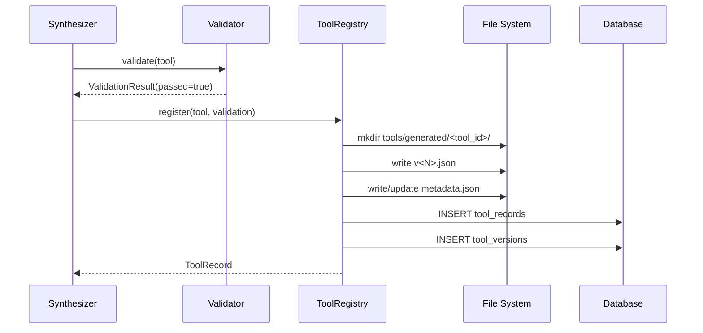

# Tool Registry & Lifecycle — Component Design

> Internal implementation details for tool storage, version management, drift detection, and auto-retirement.
>
> **Prerequisites:** [Domain Model](domain-model.md) · [Service Interfaces](service-interfaces.md)

---

## Table of Contents

- [Storage Implementation](#storage-implementation)
  - [File Layout](#file-layout)
  - [JSON Definition Format](#json-definition-format)
  - [Database Records](#database-records)
- [Version Management](#version-management)
  - [Version Creation](#version-creation)
  - [Supersession](#supersession)
  - [Rollback (Manual)](#rollback-manual)
- [Lifecycle Operations](#lifecycle-operations)
  - [Registration](#registration)
  - [Promotion](#promotion)
  - [Retirement](#retirement)
  - [Usage Tracking](#usage-tracking)
- [Drift Detection](#drift-detection)
  - [Detection Algorithm](#detection-algorithm)
  - [Drift Response](#drift-response)
- [Auto-Retirement](#auto-retirement)
  - [Staleness Check](#staleness-check)
  - [Failure Spike Detection](#failure-spike-detection)
- [Concurrency](#concurrency)
- [Configuration](#configuration)

---

## Storage Implementation

### File Layout

Promoted tool definitions live in the `tools/generated/` directory:

```
tools/
└── generated/
    ├── search_read_summarize/
    │   ├── v1.json          # Version 1 definition
    │   ├── v2.json          # Version 2 definition (current)
    │   └── metadata.json    # Registry metadata
    ├── fetch_parse_extract/
    │   ├── v1.json
    │   └── metadata.json
    └── ...
```

Each tool has its own directory. Version files are immutable once written. `metadata.json` tracks the current version and operational state.

### JSON Definition Format

Each version file (`v<N>.json`) contains a full `SynthesizedTool` serialization:

```json
{
  "tool_id": "search_read_summarize",
  "description": "Searches for documents, reads the top result, and summarizes the content.",
  "parameters": {
    "type": "object",
    "properties": {
      "query": { "type": "string", "description": "Search query" },
      "max_length": { "type": "integer", "default": 500 }
    },
    "required": ["query"]
  },
  "internal_wiring": {
    "0": { "url": "$.steps[0].output.top_result_url" },
    "1": { "content": "$.steps[1].output.text" }
  },
  "steps": [
    {
      "step_index": 0,
      "tool_id": "search",
      "input_mapping": { "query": "$.parameters.query" },
      "condition": null,
      "parallelizable_with": [],
      "timeout_ms": 5000
    },
    {
      "step_index": 1,
      "tool_id": "read",
      "input_mapping": { "url": "$.internal_wiring.0.url" },
      "condition": null,
      "parallelizable_with": [],
      "timeout_ms": 10000
    },
    {
      "step_index": 2,
      "tool_id": "summarize",
      "input_mapping": {
        "content": "$.internal_wiring.1.content",
        "max_length": "$.parameters.max_length"
      },
      "condition": null,
      "parallelizable_with": [],
      "timeout_ms": 15000
    }
  ],
  "error_strategy": {
    "retry_policy": {
      "1": {
        "max_retries": 2,
        "backoff_strategy": "exponential",
        "backoff_ms": 1000
      }
    },
    "fallback_steps": {},
    "abort_conditions": ["$.steps[0].output == null"],
    "default_behavior": "abort"
  },
  "source_chain_id": "a1b2c3d4-...",
  "version": 2,
  "status": "promoted",
  "created_at": "2026-01-15T10:30:00Z",
  "promoted_at": "2026-01-15T11:00:00Z",
  "retired_at": null
}
```

### Database Records

The registry maintains `ToolRecord` and `ToolVersion` rows in the same database as Muninn (shared `EventStore` connection):

```python
class ToolRecordRow(Base):
    __tablename__ = "tool_records"

    tool_id:           Mapped[str]          = mapped_column(String(256), primary_key=True)
    current_version:   Mapped[int]          = mapped_column(Integer, nullable=False)
    definition_path:   Mapped[str]          = mapped_column(String(512), nullable=False)
    registered_at:     Mapped[datetime]     = mapped_column(DateTime(timezone=True), nullable=False)
    last_used_at:      Mapped[datetime|None]= mapped_column(DateTime(timezone=True), nullable=True)
    invocation_count:  Mapped[int]          = mapped_column(Integer, nullable=False, default=0)
    retirement_reason: Mapped[str|None]     = mapped_column(String(64), nullable=True)


class ToolVersionRow(Base):
    __tablename__ = "tool_versions"

    tool_id:           Mapped[str]      = mapped_column(String(256), primary_key=True)
    version:           Mapped[int]      = mapped_column(Integer, primary_key=True)
    validation_passed: Mapped[bool]     = mapped_column(Boolean, nullable=False)
    equivalence_score: Mapped[float]    = mapped_column(Float, nullable=False)
    created_at:        Mapped[datetime] = mapped_column(DateTime(timezone=True), nullable=False)
    superseded_at:     Mapped[datetime|None] = mapped_column(DateTime(timezone=True), nullable=True)
```

**Why file + database?** The database provides fast queries (list, filter, count). The JSON files provide human-readable definitions that can be versioned in Git, diffed, and reviewed.

---

## Version Management

### Version Creation

When a new version of an existing tool is synthesized:

1. `SynthesizedTool.version` is incremented (enforced by the Synthesizer).
2. A new version file (`v<N>.json`) is written to the tool's directory.
3. A `ToolVersionRow` is inserted.
4. `metadata.json` is updated with the new current version.
5. `ToolRecordRow.current_version` is updated.

### Supersession

When a new version becomes current, the previous version is marked superseded:

```python
previous_version.superseded_at = datetime.now(UTC)
```

Superseded versions remain on disk and in the database. They are not deleted. This enables audit trails and rollback.

### Rollback (Manual)

Rollback is a manual CLI operation, not an automated process:

```bash
twinraven registry rollback <tool-id> --to-version <N>
```

This sets `current_version = N`, marks the rolled-back-from versions as superseded, and updates `metadata.json`. The tool remains `PROMOTED`.

---

## Lifecycle Operations

### Registration



### Promotion

For tools registered with `status=TESTING` (when `require_approval=true`):

1. Human runs `twinraven approve <tool-id> --promote`.
2. CLI calls `registry.promote(tool_id, version)`.
3. `ToolRecordRow.status` → `PROMOTED` (reflected via `SynthesizedTool` status in JSON).
4. `promoted_at` timestamp is set.

### Retirement

Retirement can be triggered manually or automatically:

| Trigger                      | `RetirementReason` | Source               |
| ---------------------------- | ------------------ | -------------------- |
| `twinraven retire <tool-id>` | `MANUAL`           | Human CLI            |
| Stale tool check             | `AUTO_UNUSED`      | Scheduled task       |
| Drift detection              | `DRIFT`            | Scheduled task       |
| Failure spike                | `FAILURE_SPIKE`    | Scheduled task       |
| New version promoted         | `SUPERSEDED`       | Registry (automatic) |

The `retire()` method sets `retired_at`, `retirement_reason`, and transitions `status` to `RETIRED`.

### Usage Tracking

Every invocation of a promoted tool (observed by Muninn) triggers:

```python
await registry.record_usage(tool_id)
```

This is called by the `AgentToolWrapper` after each successful `record()` in the Collector. It updates `invocation_count += 1` and `last_used_at = now()`.

---

## Drift Detection

### Detection Algorithm

Drift occurs when the current usage patterns of a synthesized tool's constituent tools no longer match the patterns that originally prompted synthesis.

**Detection method:**

1. Retrieve the `CandidateChain` that sourced the tool (via `source_chain_id`).
2. Re-mine the event log for the same tool sequence over recent sessions.
3. Compare the current support and confidence to the original values.

```python
drift_ratio = current_support / original_support

if drift_ratio < drift_threshold:  # Default: 0.5
    # Usage of this chain has dropped by more than 50%
    mark_for_drift_retirement(tool_id)
```

**Frequency:** Drift detection runs as part of the scheduled maintenance cycle (default: weekly).

### Drift Response

When drift is detected:

1. The tool is flagged but **not automatically retired** (configurable).
2. If `auto_retire_on_drift: true`, the tool is retired with `RetirementReason.DRIFT`.
3. If `auto_retire_on_drift: false`, a warning is logged and the tool is listed with a drift flag in `twinraven registry list`.

---

## Auto-Retirement

### Staleness Check

A tool is considered stale if it hasn't been used within `auto_retire_after_days`:

```python
stale_tools = await registry.get_stale_tools(
    unused_since=datetime.now(UTC) - timedelta(days=config.auto_retire_after_days)
)

for tool in stale_tools:
    await registry.retire(tool.tool_id, RetirementReason.AUTO_UNUSED)
```

### Failure Spike Detection

If a tool's recent failure rate exceeds a threshold:

```python
recent_events = await event_store.get_by_tool(
    tool_id,
    since=datetime.now(UTC) - timedelta(days=7),
)
failure_rate = sum(1 for e in recent_events if e.outcome == Outcome.FAILURE) / len(recent_events)

if failure_rate > config.failure_spike_threshold:  # Default: 0.3
    await registry.retire(tool_id, RetirementReason.FAILURE_SPIKE)
```

---

## Concurrency

Concurrent access to the registry is managed at the **implementation level**, not the protocol level (as resolved in the Service Interface Specification):

| Backend     | Strategy                                                                                               |
| ----------- | ------------------------------------------------------------------------------------------------------ |
| File system | `filelock` on `metadata.json` for write serialization. Reads are lock-free.                            |
| Database    | Row-level locking via `SELECT ... FOR UPDATE` on `tool_records` during version changes and retirement. |

**Conflict resolution:** Last-writer-wins for `last_used_at` and `invocation_count` (counters are idempotent in aggregate). Version transitions use database-level serialization to prevent double-promotion.

---

## Configuration

```yaml
registry:
  storage_dir: tools/generated # Tool definition directory
  auto_retire_after_days: 30 # Retire unused tools after N days
  auto_retire_on_drift: false # Auto-retire on drift detection
  drift_threshold: 0.5 # Min support ratio to avoid drift flag
  failure_spike_threshold: 0.3 # Max failure rate before spike retirement
  maintenance_schedule: weekly # Staleness/drift check frequency
```
